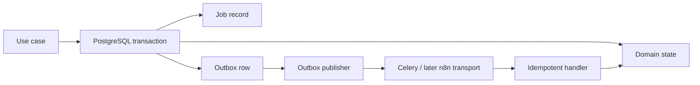

# Background Jobs and Durable Events

## Responsibilities

Celery workers execute bounded asynchronous application commands. PostgreSQL keeps the durable job record, attempt history, outbox, and dead-letter state; Redis supplies broker behavior only. A task message is a delivery hint, not proof that business work happened.

## Job contract

Every job records:

- UUID job ID, business ID, type, resource reference, status, and correlation ID.
- Requested/started/finished timestamps in UTC; deadline or timeout.
- Attempt count, retry classification, last safe error code, and dead-letter state/reason.
- Idempotency or deduplication key where the command can repeat.

Suggested baseline states: `pending`, `queued`, `running`, `succeeded`, `retry_scheduled`, `failed`, `dead_lettered`, and `cancelled`. State transitions are transactional and audited where they affect externally visible work.

## Transactional outbox

An application use case writes its domain state, job record where needed, and outbox row in one PostgreSQL transaction. A publisher claims unpublished rows, emits a message/webhook, records attempts, and only marks a row published after a successful handoff. Consumers must be idempotent because at-least-once delivery remains possible.

## Retry and dead-letter policy

- Retry only explicitly classified transient failures: network timeout, temporary service error, broker interruption, or safe optimistic-concurrency retry.
- Do not retry validation, authorization, policy, checksum, malformed-payload, or permanent-provider errors automatically.
- Use bounded exponential backoff with jitter and a maximum attempt count.
- On exhaustion, persist a dead-letter state and emit a safe operational event; do not silently discard work.
- Workers re-authorize tenant/resource state before any side effect and preserve correlation IDs in logs and downstream envelopes.

## Phase 0 limitations

The first dispatched job is `media.ingest` after completion. It records intake status only; it does not run FFmpeg, inspect media, call AI, or transfer binaries. Separate queues and resource profiles for analysis/rendering are later-phase decisions built on this contract.
