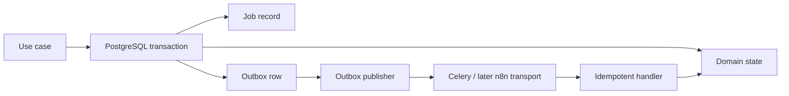

# Background Jobs and Durable Events

## Responsibilities

Celery workers execute bounded asynchronous application commands. PostgreSQL keeps the durable job record, attempt history, outbox, and dead-letter state; Redis supplies broker behavior only. A task message is a delivery hint, not proof that business work happened.

## Job contract

Every job records:

- UUID job ID, business ID, type, resource reference, status, and correlation ID.
- Requested/started/finished timestamps in UTC; deadline or timeout.
- Attempt count, retry classification, last safe error code, and dead-letter state/reason.
- Idempotency or deduplication key where the command can repeat.

Phase 0 implements `queued`, `running`, `succeeded`, `failed`, `cancelled`, and `dead`. A retryable failure remains `failed` with a due `next_attempt_at`; exhaustion becomes `dead`. State transitions are transactional and audited where they affect externally visible work.

## Transactional outbox

An application use case writes its domain state, job record where needed, and outbox row in one PostgreSQL transaction. A publisher claims unpublished rows, emits a message/webhook, records attempts, and only marks a row published after a successful handoff. Consumers must be idempotent because at-least-once delivery remains possible.

## Retry and dead-letter policy

- Retry only explicitly classified transient failures: network timeout, temporary service error, broker interruption, or safe optimistic-concurrency retry.
- Do not retry validation, authorization, policy, checksum, malformed-payload, or permanent-provider errors automatically.
- Use bounded exponential backoff with jitter and a maximum attempt count.
- On exhaustion, persist a dead-letter state and emit a safe operational event; do not silently discard work.
- Workers re-authorize tenant/resource state before any side effect and preserve correlation IDs in logs and downstream envelopes.
- A tenant-scoped recovery command locks only `running` jobs whose `started_at + timeout_seconds` has elapsed, using `FOR UPDATE SKIP LOCKED`. It finalizes the open attempt with `JOB_TIMEOUT`, then schedules bounded retry or marks the job `dead`; it never reclaims an active job.

## Phase 0 limitations

The first dispatched job is `media.ingest` after completion. It records intake status only; it does not run FFmpeg, inspect media, call AI, or transfer binaries. Separate queues and resource profiles for analysis/rendering are later-phase decisions built on this contract.

## Phase 1 video-understanding boundary

`media.video_understanding` is created only after durable scene and transcript
prerequisites exist, with a partial unique index on its tenant/resource scope.
Its requested and completed outbox events are transactionally paired with the
job creation and normalized result writes respectively. The existing stale-job
recovery handles this job type through its common `running` job contract,
including finalizing the open attempt with `JOB_TIMEOUT` and choosing retry or
dead-letter from the durable attempt budget. The Celery composition root, beat
schedule, and outbox publisher are now wired; see "Celery worker composition"
below.

Frame-extraction timeout or executable availability is classified as a
retryable video-understanding failure. Invalid source paths, invalid JPEG
outputs, frame-size/dimension policy failures, and FFmpeg non-zero exits are
terminal. In both paths the common job finalizer closes the durable attempt,
so no `JobAttempt` or job remains `started`/`running` after an extraction error.

## Timeout semantics and global recovery

`jobs.timeout_seconds` is a whole-job wall-clock budget, never an adapter timeout. FFprobe,
derivative generation, scene detection, audio extraction, ASR, frame extraction, and video
understanding each use dedicated Settings timeouts. A video-understanding budget is calculated
at creation from a base margin, real scene count × per-scene frame/provider budget, and a
persistence margin. All detected scenes remain persisted; video understanding deterministically
uses only the earliest scene prefix that fits the configured maximum rather than rolling back the
completed scene/speech transaction.

Recovery uses `started_at + timeout_seconds + JOB_TIMEOUT_GRACE_SECONDS`. It can scan all
tenants or retain a tenant filter; ordered `FOR UPDATE SKIP LOCKED` claims ensure concurrent
reapers do not finalize one attempt twice. A late worker must still own the `RUNNING` job, its
claimed attempt number, and its `STARTED` attempt before it writes results. Celery soft limit is
below hard limit, and hard
limit covers the maximum whole-job budget plus grace.

## Celery worker composition

Celery messages only wake a bounded database drain; they do not carry trusted
tenant or job identity. Each worker process creates one private composition
context and SQLAlchemy engine after fork, then opens a new session per iteration.
The drain tasks use PostgreSQL `SKIP LOCKED` claims and stop on an empty queue or
their configured batch limit.

### Worker event-loop ownership

An asyncpg connection is bound to the event loop that opened it, so a pooled
connection cannot be reused from a different loop. Each worker process therefore
owns exactly one event loop, created together with its engine in
`build_worker_context` and reused by every task through `WorkerContext.run`. A
per-task `asyncio.run` would hand pooled connections to a foreign loop and fail
with "attached to a different loop" on the second task in the same process.

`WorkerContext.run` refuses to execute on a closed loop or from inside an already
running loop, so a misuse surfaces as an explicit `WORKER_EVENT_LOOP_CLOSED` or
`WORKER_EVENT_LOOP_REENTRANT` error rather than a confusing driver error. Every
drain iteration opens and closes its own session, so no session or connection
outlives a task. `worker_process_init` replaces any inherited context, and
`worker_process_shutdown` disposes the engine, shuts down async generators, and
closes the loop exactly once.

### Outbox publisher and event routing

`CeleryOutboxPublisher` is the concrete publisher for the transactional outbox.
It maps each `*.requested` event to its drain task and calls `send_task` with no
arguments at all, so no object key, signed URL, tenant identity, credential, or
media byte reaches the broker. The dispatcher marks a row `published` only after
the enqueue succeeds; a broker outage (`kombu` `OperationalError`, `OSError`,
`TimeoutError`) is a transient failure that leaves the event unpublished for
bounded retry, and any other handoff failure is permanent and is not retried.

| Event type | Transport effect |
| --- | --- |
| `media.ingest.requested` | wake `media.ingest.drain` |
| `media.technical_analysis.requested` | wake `media.technical_analysis.drain` |
| `media.scene_speech.requested` | wake `media.scene_speech_analysis.drain` |
| `media.video_understanding.requested` | wake `media.video_understanding.drain` |
| `content.render.requested` | wake `content.render.drain` |
| `content.qc.requested` | wake `content.qc.drain` |
| `content.project.advance.requested` | wake `content.project.drain` |
| `media.technical_analysis.completed` | notification only; no message |
| `media.scene_speech.completed` | notification only; no message |
| `media.video_understanding.completed` | notification only; no message |
| anything else | `OUTBOX_EVENT_TYPE_UNSUPPORTED`, never published |

Each pipeline step creates its successor job inside its own completion
transaction, so the completion events currently drive no work. They are recorded
as delivered to an empty subscriber set rather than dead-lettered, which would
otherwise flag every successful analysis as an operational failure. Routing is an
explicit allow-list: an unregistered event type is dead-lettered instead of
silently discarded, so adding an event without registering it fails loudly.

### Beat schedule

Beat provides the safety net for lost or unsent wake-up messages; correctness
never depends on it, because every task re-derives its work from PostgreSQL.

| Schedule entry | Task | Interval setting |
| --- | --- | --- |
| `dispatch-outbox` | `operations.outbox.dispatch` | `CELERY_BEAT_OUTBOX_INTERVAL_SECONDS` |
| `drain-ingest` | `media.ingest.drain` | `CELERY_BEAT_MEDIA_DRAIN_INTERVAL_SECONDS` |
| `drain-technical` | `media.technical_analysis.drain` | `CELERY_BEAT_MEDIA_DRAIN_INTERVAL_SECONDS` |
| `drain-scene-speech` | `media.scene_speech_analysis.drain` | `CELERY_BEAT_MEDIA_DRAIN_INTERVAL_SECONDS` |
| `drain-video-understanding` | `media.video_understanding.drain` | `CELERY_BEAT_MEDIA_DRAIN_INTERVAL_SECONDS` |
| `drain-content-render` | `content.render.drain` | `CELERY_BEAT_MEDIA_DRAIN_INTERVAL_SECONDS` |
| `drain-content-projects` | `content.project.drain` | `CELERY_BEAT_MEDIA_DRAIN_INTERVAL_SECONDS` |
| `sweep-content-qc` | `content.qc.drain` | `CELERY_BEAT_QC_SWEEP_INTERVAL_SECONDS` |
| `sweep-abandoned-runs` | `content.pending.sweep` | `CELERY_BEAT_PENDING_SWEEP_INTERVAL_SECONDS` |
| `sweep-entitlement-reservations` | `entitlement.reservation.sweep` | `CELERY_BEAT_ENTITLEMENT_SWEEP_INTERVAL_SECONDS` |
| `recover-stale-jobs` | `operations.recovery.drain` | `CELERY_BEAT_RECOVERY_INTERVAL_SECONDS` |

**Automatic QC got its producer in slice 2E, and the measurement W18 left behind is settled.**
W18 shipped `content.qc.drain` as the one entry that was the trigger rather than a safety net:
nothing in the render path wrote an event, so the claim asked the database directly — *which
succeeded render carries no QC report?* — as a hash anti-join over two scans, measured at
**~134 ms per tick at 200k renders**. W18 also measured that an index alone does not help: the
planner will not pick the nested loop, because nothing tells it that unchecked renders are always
the newest ones. The conclusion it recorded was that **the query had to express that
correlation**, and it handed the decision to the slice that owns `render_service.py`.

Slice 2E did both halves:

1. `render_service._succeed` writes `content.qc.requested` in the transaction that makes a render
   succeed, so QC is now event-driven and the tick drops to a rare sweep
   (`CELERY_BEAT_QC_SWEEP_INTERVAL_SECONDS`, default 900 s) that catches a render finished while
   the worker was down.
2. The claim's predicate moved onto the render row. `render_outputs.qc_claimed_at` is stamped in
   the same transaction that writes the `pending` report, and `ix_render_outputs_awaiting_qc` is a
   partial index over `status = 'succeeded' AND qc_claimed_at IS NULL` — a set that is **empty in
   steady state**. Migration `0016` backfills the column for every render that already carries a
   report, so the change does not offer the whole history back to QC.

Re-measured on the same 200k-render fixture (PostgreSQL 17, single server, `EXPLAIN ANALYZE`):

| Claim shape | Plan | Time |
| --- | --- | --- |
| W18: anti-join, no predicate on the render row | merge anti-join over a 200k index scan + an external-merge sort of every report | **199 ms** (354 ms cold) |
| W19: `qc_claimed_at IS NULL`, one render awaiting | **index scan on `ix_render_outputs_awaiting_qc`** + nested-loop anti-join | **3.6 ms** |
| W19: steady state, nothing awaiting | same index scan, anti-join never executed | **0.05 ms** |

The plan genuinely changed — that was W18's actual open question, and the index is now the one
the planner picks rather than one it ignores. The residual 3.6 ms when work *does* exist is the
anti-join probing `ix_render_qc_reports_business_render` by `render_id` alone; a dedicated index
on `render_qc_reports(render_id)` would remove it, and it is deliberately not added, because that
cost is paid only on a tick that is about to run a whole QC job and the write cost would be paid
by every report. The anti-join itself stays as a second, independent statement of "one run per
render": the column and the report are written together and can only diverge through a defect.

**`entitlement.reservation.sweep` maintains a set that should always be empty (slice W20).**
A credit hold is settled inside the transaction that makes its content project terminal, so there
is no window in which a finished project still holds credit and no crash that can create one.
What this tick covers is the case atomicity cannot: a source row that no longer exists. It never
guesses — a hold is released only when the module that owns the work says the work is over,
through `ReservationSourceProbe`, so age alone is never evidence. `ENTITLEMENT_RESERVATION_SWEEP_AGE_SECONDS`
is validated at startup to exceed one lifecycle step timeout, and the batch is capped by
`ENTITLEMENT_SWEEP_BATCH_SIZE`; a full batch is **reported** in the task result (`batch_full`)
rather than silently truncated, because a truncated sweep reads exactly like a clean one.

**`content.pending.sweep` is the other entry that cannot have a producer.** It settles script
and voiceover rows that opened before a provider call and never came back, and nothing emits an
event for a process dying mid-call — an absence is only observable on a tick. Its age threshold
(`LIFECYCLE_PENDING_SWEEP_AGE_SECONDS`) is validated at startup to exceed the longest honest run
of either capability, so a slow run cannot be declared abandoned.

## Content projects (PRD §20, slice 2E)

`content_projects` is a durable job without a `jobs` row, and that is deliberate: a sequencer's
state *is* its result, so keeping the same fact in two tables would give a crashed worker two
answers to "where is this project". Every property this document requires of background work is
on the project itself — a status (`state`), a timeout (`state_entered_at` against
`LIFECYCLE_STEP_TIMEOUT_SECONDS`), attempt counters (`render_attempts`, `step_attempts`), a
correlation id, and `FAILED` as the dead letter. `next_check_at` is both the due time the claim
orders by and the lease: the claim pushes it out by `LIFECYCLE_LEASE_SECONDS`, so a worker that
dies mid-step releases the project instead of holding it, and the step then runs again from the
top — safe because every sub-call carries a deterministic idempotency key.

Two bounds are load-bearing. `LIFECYCLE_MAX_RENDER_ATTEMPTS` (default 2, capped at 10 by the
field itself) is read *before* a render is requested, and `lifecycle.decide_after_qc` returns no
"retry" outcome at or above it — an unbounded re-render loop is not expressible rather than
merely unlikely. `LIFECYCLE_MAX_STEP_ATTEMPTS` bounds transient step failures; a 4xx from a
sub-service ends the project immediately, a 5xx buys another attempt.

Beat runs as a separate read-only `celery-beat` Compose service rather than a
worker `-B` flag, so scheduling never shares a process with media execution and
cannot be duplicated by worker concurrency. Development assumes exactly one beat
replica: the schedule file lives in the container's `tmpfs`, so a second replica
would double every tick. Duplicate ticks remain safe because the drain tasks are
idempotent `SKIP LOCKED` claims, but production still needs single-instance
ownership or leader election, deferred to Phase 1E.
