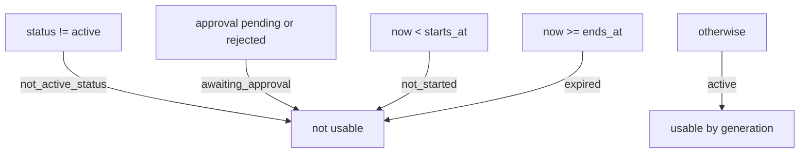

# Brand Profile and Product Catalogue

The brand module holds the records content generation is allowed to quote. Its whole purpose is
the hardest rule in the product: **AI never writes a price or a campaign date; it reads a
verified record** (PRD §11.3). Everything here is entered by a human in an authorized role, and
every read is tenant-scoped.

## What the module owns

| Concern | Tables |
|---|---|
| Brand identity | `brand_profiles`, `brand_assets` |
| Audience | `target_audiences` |
| Catalogue | `products`, `product_prices` |
| Campaigns | `campaign_offers`, `campaign_offer_products` |
| Content safety | `approved_claims`, `forbidden_claims`, `approved_ctas` |

`brand_assets` is a reference, not a second upload path: it carries a foreign key to
`media_assets` (ADR-002 still owns the byte path) with `ON DELETE RESTRICT`, so deleting media a
brand uses as its logo fails loudly instead of silently emptying the identity. The reference is
accepted only when the asset belongs to the same business **and** finished ingest.

`campaign_offer_products` is not in PRD §28.2's list; it is the mechanical link table the
"campaign has products" relation requires. It uses foreign keys rather than a JSON array of ids
so a campaign can never cite a product that no longer exists.

## Money

Money is an integer count of minor units beside its ISO-4217 code — `price_minor = 16500` with
`currency = "TRY"` is ₺165,00. There is no floating or numeric money column, no decimal string,
and no conversion anywhere in the module; `tests/unit/test_brand_catalog_unit.py` asserts this
against the mapped columns, the module source, and the public OpenAPI schema.

Two currency rules keep a generated post able to state a total:

1. A business has one **currency of record** (`brand_profiles.default_currency`). A product price
   in another currency is rejected with `CURRENCY_MISMATCH`. Before a brand profile exists, the
   first price is free to set the currency.
2. Changing the currency of record while open prices exist in another currency is rejected, and a
   product's own currency never changes after its first price.

`product_prices` is append-only. A reprice closes the open row (`effective_to = now`) and appends
a new one; a partial unique index enforces exactly one open row per product, so "what is the
current price" has one answer at the storage layer rather than in whichever service method asks.
The history is why a post published last month can still be explained.

## Campaign activity is deterministic

The window is half-open, `[starts_at, ends_at)`: a campaign is active at its exact start instant
and already expired at its exact end instant. PRD §2.2 forbids generating content for a campaign
whose date has passed, so the boundary falls on the safe side. Timestamps are stored in UTC and a
request without a timezone offset is refused — it names no instant.

The rule exists twice by necessity: as the pure function `domain.evaluate_campaign_activity`
(used when rendering a record) and as the SQL predicate `active_campaign_conditions` (used to
filter a list). An integration test creates rows on each boundary and asserts the two agree, so
they cannot drift.

`approval_status` defaults to `not_required` because the approval workflow (PRD §11.1 item 11)
and the `approver` role do not exist yet. Creation may set `not_required` or `pending`; it may
never set `approved` or `rejected`, because granting an approval is not part of creating a
record. When the approval slice lands it owns those transitions.

## Authorization

The brand module owns no permission table. `businesses.policy` remains the only authority;
`brands.policy` maps a named brand action onto an existing permission:

| Action | Permission | owner | admin | editor | viewer |
|---|---|:--:|:--:|:--:|:--:|
| `brand.read`, `catalog.read`, `campaign.read` | `business.read` | ✅ | ✅ | ✅ | ✅ |
| `brand.write`, `catalog.write`, `campaign.write` | `business.update` | ✅ | ✅ | ❌ | ❌ |

This matches PRD §4: an editor uploads media and produces content but does not change what the
brand claims about itself. A non-member receives `404` (existence is not disclosed); a member
without the permission receives `403`.

## Idempotency

Every mutation was evaluated, not merely the convenient ones:

| Endpoint | Decision |
|---|---|
| `POST /products`, `POST /campaign-offers` | `Idempotency-Key` supported. A replay returns the original resource; the same key with a different body is `IDEMPOTENCY_CONFLICT`. |
| `PUT /brand` | Idempotent by construction — the brand identity is one document and a full replacement of it converges. A key would add a row without adding a guarantee. |
| `PATCH /products/{id}` | Idempotent by construction — it writes explicit field values to one identified row. A reprice to the same amount is a no-op rather than a new price row. |

Every mutation also writes an audit record naming the actor, action and correlation ID.

## Cursor pagination

`app/core/pagination.py` is the reusable primitive (PRD §29.1) and stays technical — it knows
about a timestamp and a UUID, never about a domain type. Ordering is `created_at DESC, id DESC`;
the tie-break is what makes the boundary total, and the keyset predicate continues strictly after
the last row the client actually saw, so an insert during a page walk cannot skip or repeat a
row the way an `OFFSET` can. The cursor is opaque, unpadded base64url and is validated strictly:
a cursor that does not decode is `PAGINATION_CURSOR_INVALID`, never a silent reset to page one.
It carries no authorization — the tenant filter is reapplied on every page.

`limit` defaults to 20 and is capped at 100 by the transport; the primitive clamps as well for
internal callers.

`GET /businesses` and `GET /media` are **not** retrofitted here: that is a response-shape change
affecting the mobile client and belongs in its own slice.

## Brand health score

`GET /brand/health` computes PRD §10.4 deterministically, with no model involved. It is advisory:
it is a read, so it cannot block a write by construction, and the response says `advisory: true`.

Eight of the eleven components are measurable today. The three that measure unbuilt modules —
connected social account, publishing hours, advertising conversion tracking — are reported as
`unavailable` and excluded from the denominator, because a score that punishes a tenant for a
feature that does not exist yet is a false signal. Whether a missing component blocks a specific
scenario is a generation rule, not the score's job.

## Requirements and related documents

PRD [§11](../product/requirements/20-brand-catalog.md) ·
[§10.3–10.4](../product/requirements/15-mobile-experience.md) ·
[§28.2](../product/requirements/90a-database-design.md) ·
[§29.1, §29.4](../product/requirements/90b-api-error-contracts.md) ·
[§4](../product/requirements/10-identity-tenancy.md) ·
[tenant-isolation.md](tenant-isolation.md) · [backend-modules.md](backend-modules.md) ·
[error-handling.md](error-handling.md) ·
[ADR-001](../adr/ADR-001-modular-monolith.md) · [ADR-002](../adr/ADR-002-direct-object-storage-upload.md)
