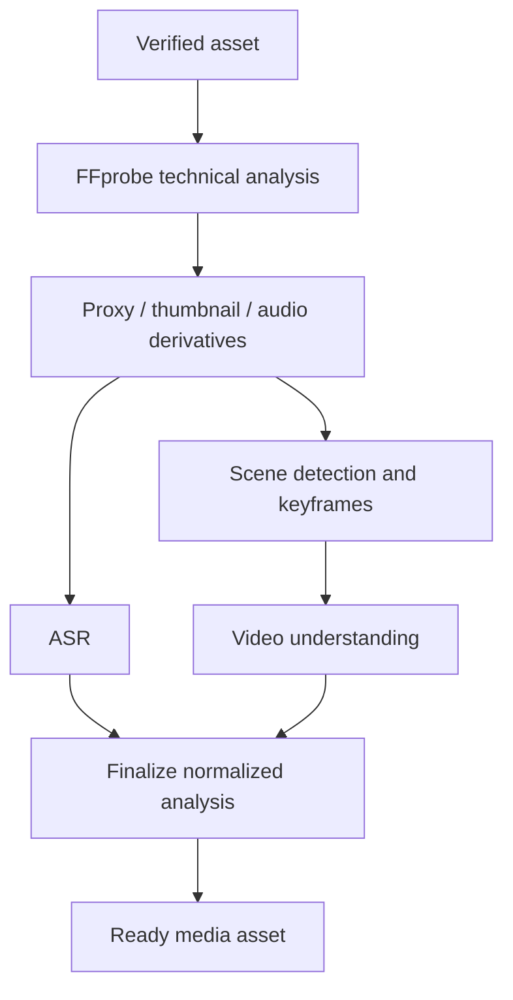

# Media Analysis Architecture

## Scope

Phase 1 analysis begins only after the ingest security gate succeeds. It produces trusted technical metadata, immutable derivatives, scenes, transcript segments, and normalized scene-understanding results. It does not render final content, select a final Reels edit, publish social posts, or invoke n8n.

## Worker topology

Workers use separate queues/resource profiles for ingest, media analysis, ASR, and VLM work. PostgreSQL job status controls eligibility; Redis/Celery is only delivery. Prerequisites are checked from durable state at execution, so an out-of-order message cannot advance the asset.

## Technical-analysis contract

`MediaProbePort` exposes verified container/stream facts: duration, container, codec, width, height, normalized rotation/aspect ratio, frame-rate numerator/denominator, video/audio stream presence, audio sample rate/channels, and bounded safe diagnostics. Original FFprobe output is diagnostic-only and must never become an API response or an audit payload.

`MediaDerivativePort` creates a recorded proxy, thumbnails/keyframes, waveform where required, and extracted audio. Every `media_variant` is immutable, carries a content checksum/size/type/provenance, and is stored in the asset's tenant namespace. The original is never overwritten.

## Subprocess safety

- Resolve fixed trusted executable paths; pass argument arrays to `exec`, never a shell command string.
- Treat filenames, object metadata, subtitle/transcript text, and all media-embedded strings as data; they cannot select an executable, option, filter, path, or URL.
- Materialize bounded input in a per-job restricted temporary directory; allow only controlled output paths; clean up in `finally` and on worker recovery.
- Enforce process, wall-clock, CPU, memory, disk, open-file/output-size, and network limits. Workers run with least privilege and no host socket/credential mount.
- Probe before expensive transforms, validate every output, and classify timeout/resource exhaustion separately from permanent malformed input.

## Scene and transcript data

Scenes are a versioned processing-run result: start/end milliseconds are ordered, non-overlapping, and bounded by verified duration. Keyframes reference an immutable derivative and validated timestamp. ASR normalizes language, bounded transcript text, segments, confidence (0–1), and optional speaker labels. Captions may be derived later from this data, but stored raw provider responses are avoided unless an approved encrypted retention policy exists.

## Result aggregation

The finalizer validates that all enabled mandatory analysis steps produced compatible run/version data. It records a safe aggregate readiness state and emits `media.ready` transactionally. A partial result remains attached to its processing run for operations, but does not mark the asset ready. Reprocessing creates a new run, leaving past provenance immutable.
