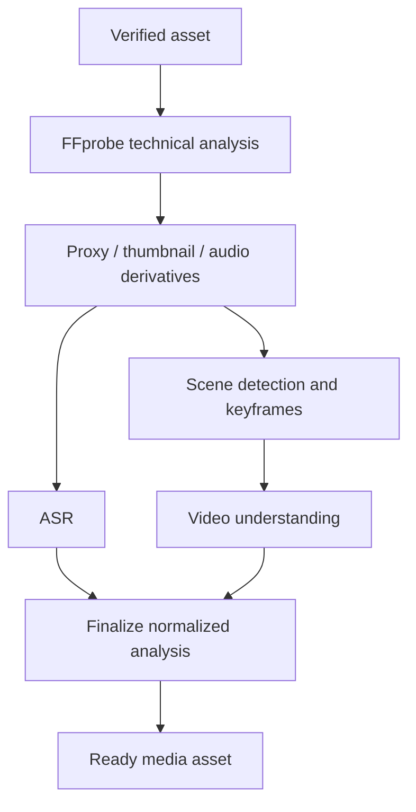

# Media Analysis Architecture

## Scope

Phase 1 analysis begins only after the ingest security gate succeeds. It produces trusted technical metadata, immutable derivatives, scenes, transcript segments, and normalized scene-understanding results. It does not render final content, select a final Reels edit, publish social posts, or invoke n8n.

## Worker topology

Workers use separate queues/resource profiles for ingest, media analysis, ASR, and VLM work. PostgreSQL job status controls eligibility; Redis/Celery is only delivery. Prerequisites are checked from durable state at execution, so an out-of-order message cannot advance the asset.

The current video-understanding slice creates `media.video_understanding` and
its requested outbox event in the same scene/speech-completion transaction. A
tenant-scoped service locks one due job, verifies the READY proxy, scenes, and
completed or `no_speech` transcript, then writes every scene understanding and
the completion event atomically. Frame extraction and VLM invocation are still
deterministic fake ports at this stage; real FFmpeg extraction, provider route
selection, and Celery worker composition are deferred. The durable job timeout
is separately configured and cannot be less than the combined frame/provider
step timeouts.

## Technical-analysis contract

`MediaProbePort` exposes verified container/stream facts: duration, container, codec, width, height, normalized rotation/aspect ratio, frame-rate numerator/denominator, video/audio stream presence, audio sample rate/channels, and bounded safe diagnostics. Original FFprobe output is diagnostic-only and must never become an API response or an audit payload.

`MediaDerivativePort` creates a recorded proxy, thumbnails/keyframes, waveform where required, and extracted audio. Every `media_variant` is immutable, carries a content checksum/size/type/provenance, and is stored in the asset's tenant namespace. The original is never overwritten.

Technical admission validates FFprobe's encoded raster against `MEDIA_MAX_LONG_EDGE`, `MEDIA_MAX_SHORT_EDGE`, and `MEDIA_MAX_TOTAL_PIXELS`; it is deliberately orientation-independent, so landscape and portrait sources follow the same policy. Rotation is retained as metadata and does not change that admission decision. FFmpeg uses its normal autorotation behavior for derivatives, while the symmetric admission check remains invariant. Proxy and thumbnail targets are independent from source-admission limits: the default proxy bounds are 1280x720 and the thumbnail bounds are 640x640. FFmpeg preserves aspect ratio, never enlarges a source, and produces codec-safe even proxy dimensions (for example, a 1080x1920 source becomes approximately 404x720).

Transcript persistence uses PostgreSQL `TEXT`, but remains application-bounded: each normalized segment is limited by `TRANSCRIPT_MAX_SEGMENT_CHARS`, the joined representation by `TRANSCRIPT_MAX_TOTAL_CHARS`, and the segment count by `TRANSCRIPT_MAX_SEGMENT_COUNT`. Provider text is untrusted: NUL and other control characters are rejected, CRLF/CR are normalized to LF, and ordinary spaces, tabs, and newlines remain valid. Neither raw transcript text nor provider diagnostics is logged or included in safe error responses.

## Subprocess safety

- Resolve fixed trusted executable paths; pass argument arrays to `exec`, never a shell command string.
- Treat filenames, object metadata, subtitle/transcript text, and all media-embedded strings as data; they cannot select an executable, option, filter, path, or URL.
- Materialize bounded input in a per-job restricted temporary directory; allow only controlled output paths; clean up in `finally` and on worker recovery.
- The development worker's writable `/tmp` is capped at 512 MiB. A scene/speech job materializes at most the 50 MiB proxy and may create a 115,200,044-byte 16 kHz mono signed-16-bit PCM WAV (3600 seconds x 32,000 bytes plus a 44-byte WAV header), leaving bounded headroom. Technical jobs separately materialize at most 100 MiB and produce bounded derivatives. Deployments must increase the temporary-disk budget together with any of those limits.
- Enforce process, wall-clock, CPU, memory, disk, open-file/output-size, and network limits. Workers run with least privilege and no host socket/credential mount.
- Probe before expensive transforms, validate every output, and classify timeout/resource exhaustion separately from permanent malformed input.

## Scene and transcript data

Scenes are a versioned processing-run result: start/end milliseconds are ordered, non-overlapping, and bounded by verified duration. Keyframes reference an immutable derivative and validated timestamp. ASR normalizes language, bounded transcript text, segments, confidence (0–1), and optional speaker labels. Captions may be derived later from this data, but stored raw provider responses are avoided unless an approved encrypted retention policy exists.

## Result aggregation

The finalizer validates that all enabled mandatory analysis steps produced compatible run/version data. It records a safe aggregate readiness state and emits `media.ready` transactionally. A partial result remains attached to its processing run for operations, but does not mark the asset ready. Reprocessing creates a new run, leaving past provenance immutable.
