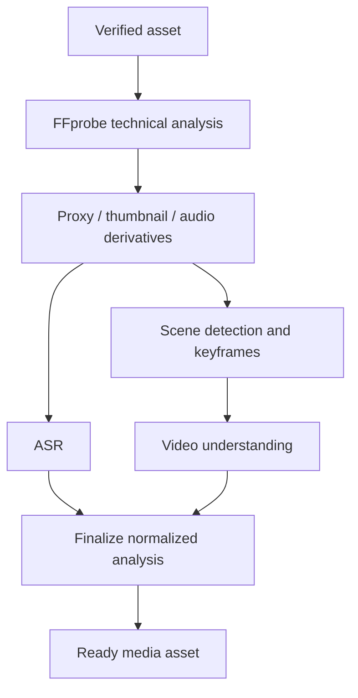

# Media Analysis Architecture

## Scope

Phase 1 analysis begins only after the ingest security gate succeeds. It produces trusted technical metadata, immutable derivatives, scenes, transcript segments, and normalized scene-understanding results. It does not render final content, select a final Reels edit, publish social posts, or invoke n8n.

## Worker topology

Workers use separate queues/resource profiles for ingest, media analysis, ASR, and VLM work. PostgreSQL job status controls eligibility; Redis/Celery is only delivery. Prerequisites are checked from durable state at execution, so an out-of-order message cannot advance the asset.

The current video-understanding slice creates `media.video_understanding` and
its requested outbox event in the same scene/speech-completion transaction. A
tenant-scoped service locks one due job, verifies the READY proxy, scenes, and
completed or `no_speech` transcript, then writes every scene understanding and
the completion event atomically. VLM invocation is still a deterministic fake
port at this stage and provider route selection remains deferred; real FFmpeg
frame extraction and Celery worker composition are wired. The durable job timeout
is separately configured and cannot be less than the combined frame/provider
step timeouts. Frame extraction materializes the tenant-scoped READY proxy into
a per-job temporary directory, invokes only the fixed absolute FFmpeg/FFprobe
paths with argument arrays and bounded timeouts, and passes validated JPEG
paths (never frame bytes) to the provider port. Frames are deterministic within
each scene, stay within its time bounds, are capped per asset, and are removed
with the temporary directory after the provider returns. The default 50 frames
at 1 MiB each reserve no more than 50 MiB of the worker's 512 MiB `/tmp`. The
extractor invokes one bounded FFmpeg subprocess per selected frame; its job
budget therefore includes `frames_per_scene × frame-extraction timeout` plus
provider timeout and persistence margin. On asset-budget exhaustion later scenes
use an empty frame tuple for transcript-only or safe no-context analysis; this
is not a retry condition.

### Service-authoritative quality signals

The service, never the provider, decides how a scene was analyzed. For each scene
it derives a `SceneAnalysisMode` from its own inputs — whether frames were
extracted and whether transcript context exists — yielding `visual`,
`visual_and_transcript`, `transcript_only`, or `no_context`. That mode is what
stamps `visual_input_available` and `analysis_mode`, and a non-visual mode applies
a deterministic confidence cap so provider output cannot represent a frameless
result as full visual analysis.

Provider output is untrusted data. `normalize_result` discards any provider-supplied
copy of a service-authoritative quality-signal key
(`SERVICE_AUTHORITATIVE_QUALITY_SIGNALS`: `visual_input_available`, `analysis_mode`,
and every coverage key) before the DTO reaches the domain model, consistent with how
unknown provider fields are discarded. Filtering happens after key normalization, so
a reserved key cannot be smuggled through alternate encoding. A provider may still
report its own diagnostic signals, such as `frame_count`.

### Completion coverage

The `media.video_understanding.completed` event carries server-calculated coverage
derived from the recorded per-scene modes, not from the returned quality-signal
dictionary — so provider output cannot influence a single count:

| Field | Meaning |
| --- | --- |
| `total_scene_count` | every persisted scene for the asset |
| `analyzed_scene_count` | scenes inside the supported scope that were analyzed |
| `skipped_scene_count` | `total - analyzed`, from deterministic scope capping |
| `coverage` | `full` when analyzed equals total, otherwise `partial` |
| `frame_backed_scene_count` | scenes analyzed with real visual frames |
| `transcript_only_scene_count` | frameless scenes with transcript context |
| `no_context_scene_count` | frameless scenes without transcript context |

The payload holds integer counts and the coverage label only. It never includes
transcript text, provider text, object keys, or signed URLs. An impossible
combination (no analyzed scenes, or more analyzed than total) raises
`VIDEO_UNDERSTANDING_COVERAGE_INVALID` instead of emitting a misleading event.

## Client processing summary

`GET /v1/businesses/{business_id}/media/{asset_id}/processing-summary` returns the whole
pipeline in one tenant-scoped read so a client screen needs no per-stage fan-out. The
route delegates to `ProcessingSummaryService`, which authorizes through the media module
(`MEDIA_READ`) and reads only durable records — it runs no provider work and writes
nothing.

`current_step` is derived in strict pipeline order — `uploading`, `uploaded`,
`security_check`, `technical_analysis`, `scene_speech_analysis`, `video_understanding`,
`completed`, or `failed` — from asset/ingest status, technical status, transcript and
scene presence, and the video-understanding job outcome.

`terminal_failure_code` is set only for states no retry can leave: a rejected or
quarantined asset, a rejected or `dead` ingest, a blocking scan verdict, a `dead` stage
record, or a `dead` job. A `failed` job keeps a due `next_attempt_at`, so it is reported
as still in progress rather than terminal.

Coverage is recomputed from the persisted service-authoritative `analysis_mode` of each
scene understanding rather than read from the completion outbox event, so a read API does
not depend on transport state. If any stored mode cannot be parsed, coverage is omitted
instead of guessed. Results are returned in scene-index order, because understandings
written in one transaction share a `created_at` and would otherwise be ordered by a
random UUID tie-break.

The response carries no `storage_object_key`, `storage_upload_id`, `storage_etag`, signed
URL, or credential, and it exposes only the service-authoritative quality signals rather
than the raw provider dictionary. Transcript and provider text are returned to the
authorized caller but never logged. Collections are bounded by
`PROCESSING_SUMMARY_MAX_ITEMS` with explicit `*_truncated` flags; cursor pagination is a
later concern.

## Technical-analysis contract

`MediaProbePort` exposes verified container/stream facts: duration, container, codec, width, height, normalized rotation/aspect ratio, frame-rate numerator/denominator, video/audio stream presence, audio sample rate/channels, and bounded safe diagnostics. Original FFprobe output is diagnostic-only and must never become an API response or an audit payload.

`MediaDerivativePort` creates a recorded proxy, thumbnails/keyframes, waveform where required, and extracted audio. Every `media_variant` is immutable, carries a content checksum/size/type/provenance, and is stored in the asset's tenant namespace. The original is never overwritten.

Technical admission validates FFprobe's encoded raster against `MEDIA_MAX_LONG_EDGE`, `MEDIA_MAX_SHORT_EDGE`, and `MEDIA_MAX_TOTAL_PIXELS`; it is deliberately orientation-independent, so landscape and portrait sources follow the same policy. Rotation is retained as metadata and does not change that admission decision. FFmpeg uses its normal autorotation behavior for derivatives, while the symmetric admission check remains invariant. Proxy and thumbnail targets are independent from source-admission limits: the default proxy bounds are 1280x720 and the thumbnail bounds are 640x640. FFmpeg preserves aspect ratio, never enlarges a source, and produces codec-safe even proxy dimensions (for example, a 1080x1920 source becomes approximately 404x720).

Scene detection uses its own provider-neutral timeout and reports timeout as a retryable
dependency failure. It does not inherit the scene/speech whole-job wall-clock budget; this same
step/job separation applies to FFprobe, derivatives, audio extraction, ASR, frame extraction,
and video understanding.

Transcript persistence uses PostgreSQL `TEXT`, but remains application-bounded: each normalized segment is limited by `TRANSCRIPT_MAX_SEGMENT_CHARS`, the joined representation by `TRANSCRIPT_MAX_TOTAL_CHARS`, and the segment count by `TRANSCRIPT_MAX_SEGMENT_COUNT`. Provider text is untrusted: NUL and other control characters are rejected, CRLF/CR are normalized to LF, and ordinary spaces, tabs, and newlines remain valid. Neither raw transcript text nor provider diagnostics is logged or included in safe error responses.

## Subprocess safety

- Resolve fixed trusted executable paths; pass argument arrays to `exec`, never a shell command string.
- Treat filenames, object metadata, subtitle/transcript text, and all media-embedded strings as data; they cannot select an executable, option, filter, path, or URL.
- Materialize bounded input in a per-job restricted temporary directory; allow only controlled output paths; clean up in `finally` and on worker recovery.
- The development worker's writable `/tmp` is capped at 512 MiB. A scene/speech job materializes at most the 50 MiB proxy and may create a 115,200,044-byte 16 kHz mono signed-16-bit PCM WAV (3600 seconds x 32,000 bytes plus a 44-byte WAV header), leaving bounded headroom. Technical jobs separately materialize at most 100 MiB and produce bounded derivatives. Deployments must increase the temporary-disk budget together with any of those limits.
- Enforce process, wall-clock, CPU, memory, disk, open-file/output-size, and network limits. Workers run with least privilege and no host socket/credential mount.
- Probe before expensive transforms, validate every output, and classify timeout/resource exhaustion separately from permanent malformed input.

## Scene and transcript data

Scenes are a versioned processing-run result: start/end milliseconds are ordered, non-overlapping, and bounded by verified duration. Keyframes reference an immutable derivative and validated timestamp. ASR normalizes language, bounded transcript text, segments, confidence (0–1), and optional speaker labels. Captions may be derived later from this data, but stored raw provider responses are avoided unless an approved encrypted retention policy exists.

## Result aggregation

The finalizer validates that all enabled mandatory analysis steps produced compatible run/version data. It records a safe aggregate readiness state and emits `media.ready` transactionally. A partial result remains attached to its processing run for operations, but does not mark the asset ready. Reprocessing creates a new run, leaving past provenance immutable.
