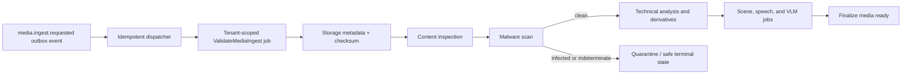

# Media Ingest Pipeline

## Purpose

Phase 1 turns a completed direct multipart upload into a verified, processable media asset. The API authorizes and records intent; storage transfers bytes directly; workers run bounded processing; PostgreSQL records durable truth. A client-declared MIME type, filename, checksum, or storage object is never trusted by itself.

## Flow

Each arrow that advances durable work is written as an outbox row in the same PostgreSQL transaction as the preceding state change. Celery messages may repeat, arrive late, or fail to arrive; the dispatcher/handler uses the durable job and processing-run identity to resume safely.

## Boundaries

- FastAPI never receives original, proxy, audio, thumbnail, keyframe, or scene bytes.
- n8n is outside this pipeline and cannot transport media or decide media state.
- `ObjectStoragePort` owns provider interactions. Its worker operation issues only narrowly scoped, short-lived access and returns neutral metadata; signed URLs, provider SDK types, and credentials do not cross into domain/application models.
- The media module owns asset and processing-run transitions. The operations module owns durable jobs/attempts/outbox; adapters do not mutate tables directly.

## Security gate

Before any FFprobe, derivative, ASR, or VLM work, the worker checks the immutable server-generated object identity, `business_id`, expected size, SHA-256, detected type/container, policy limits, and malware result. A mismatch/unsupported format is rejected; infected or security-indeterminate media is quarantined. A transient scanner outage may retry but may not bypass the gate.

## Materialization and the analysis gate

Workers never receive bytes from FastAPI; each analysis stage streams the object it needs
(the original, or the proxy) from storage to a bounded scratch directory through the
`MediaMaterializerPort`. The real adapter (`S3MediaMaterializer`, ADR-009) reuses the storage
adapter's signing, checks size with `HeadObject` before streaming, and always removes its
partial file on error, cancellation, or timeout (§19.3). Selection mirrors the storage adapter
(`MATERIALIZER_ADAPTER=fake|s3`); `production` refuses the fixture fake.

After a clean security gate, ingest schedules technical analysis for the supported video
*containers* (`MEDIA_ANALYZABLE_VIDEO_TYPES`: `video/mp4`, `video/quicktime`). Container
admission is not codec admission: technical analysis validates the ffprobe-resolved codec
against `MEDIA_SUPPORTED_VIDEO_CODECS` (`h264`, `hevc`) and rejects an unsupported codec with a
documented code (`TECHNICAL_VIDEO_CODEC_UNSUPPORTED`) rather than stopping silently. HEVC input
is proxied to H.264 (§15.5). HEIC/HEIF photos are admitted at upload but have no analysis
pipeline yet, so ingest declines them explicitly (`INGEST_ANALYSIS_UNSUPPORTED_MEDIA_TYPE`,
asset `rejected`) instead of leaving them in a silent dead end; JPEG/PNG and audio keep their
accepted-no-video-analysis contract (ADR-009).

## States

The asset progresses `uploaded → validating → processing → ready`. Unsupported, corrupt, checksum-mismatched, or permanently disallowed media becomes `rejected`; infected or security-indeterminate media becomes `quarantined`. Retriable work remains visible in the durable job state rather than inventing a second asset failure state. Deletion follows `purging → deleted` and prevents new effects.

## Tenant and idempotency rules

- Every asset, processing run, variant, inspection, scan, job, outbox event, audit record, object namespace, and provider-usage record carries `business_id`.
- Workers reload the asset through a tenant-scoped repository and re-check business/member/resource state before a side effect.
- The ingest event/handler deduplicates by asset and processing-stage/run identity. An external retry or duplicate Celery delivery must not create a second scan, derivative, or final state transition.
- Authorized reprocessing creates a separate run/provenance record, is idempotency-protected, audited, quota-checked, and cannot overwrite active or historical results.

## Failure handling

Validation, policy, checksum, malware-infected, and malformed-result failures are non-retryable. Explicitly classified transient storage/scanner/worker failures use bounded exponential backoff with jitter, deadline, and maximum attempt count; exhaustion is `dead` with a safe error code/summary. Correlation ID, business ID, asset ID, job ID, and attempt are structured-log fields; signed URLs, object credentials, raw media metadata, and raw provider payloads are excluded.
