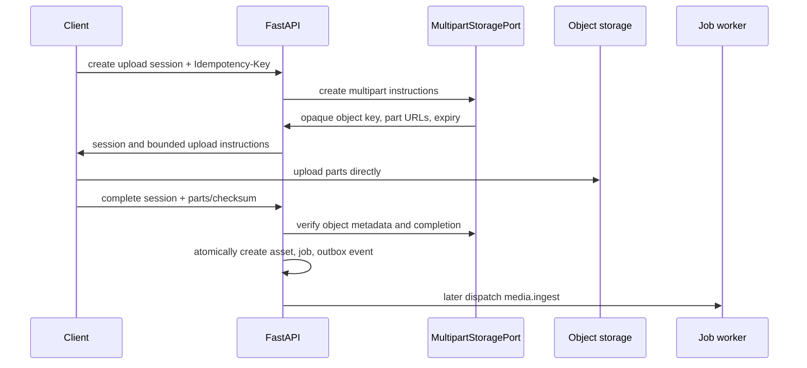

# Direct Media Upload Architecture

## Goal

Allow resumable large-media uploads without sending media bytes through FastAPI or n8n. The API owns authorization, intent, state, and verification; an object-storage adapter owns provider-specific multipart instructions.

## Upload lifecycle

## States

`created → uploading → uploaded → validating → processing → ready` is the eventual media lifecycle. Phase 0 implements only session creation, direct transfer coordination, completion verification, `uploaded`, and the creation of a pending ingest job. `rejected`, `quarantined`, `deleted`, and `purging` are reserved states with no Phase 0 processing implementation.

## Required contract

- Create requests include declared media type, byte size, SHA-256 checksum, and allowed multipart parameters; validation checks plan/tenant size policy before adapter invocation.
- Adapter responses contain only short-lived, least-privilege upload instructions. They are never logged, stored in audit details, or returned after expiry.
- Object keys are generated server-side: `tenant/{business_id}/media/{asset_id}/original/{opaque-name}`. Original objects are immutable after completion.
- Complete requests include upload/session IDs, part eTags or equivalent, checksum, and metadata assertions. The adapter verifies provider-side completion and metadata; the server does not trust client declarations.
- Completion is authorized, stateful, and idempotent. A duplicate with the same key returns the original result; conflicting payloads fail.
- The transaction creates the media asset, durable ingest job, audit entry where required, and `media.ingest.requested` outbox event together.

## Security boundaries

Filename and media-embedded text are untrusted. Phase 0 does not claim content safety from client MIME alone. Later ingestion must inspect content, enforce size/type limits, scan malware, use isolated parsers/FFmpeg, and quarantine failures before any AI or publication use.

## Adapter boundary

The domain depends on a provider-neutral `MultipartStoragePort` with operations such as create session, list/verify parts, finalize, inspect metadata, and revoke/expire session. No provider object types leak into entities, use cases, or API schemas.

Two implementations exist, selected by `STORAGE_ADAPTER`:

| Value | Implementation | Use |
|---|---|---|
| `fake` | `FakeMultipartStorage` | Default. Byte-free, in-process; part URLs are deliberately unreachable and completion needs a test hook. Development and the control-plane test suite. |
| `s3` | `S3MultipartStorage` | MinIO locally, S3/R2 in production. The real byte path. |

`production` refuses `fake` at settings validation, alongside the identity-adapter guard.

### S3-compatible adapter

Signs SigV4 requests over `httpx`; no vendor SDK enters the async request path. Rationale, trade-offs, and rejected alternatives are in [ADR-008](../adr/ADR-008-s3-compatible-storage-adapter.md).

- **Session creation** opens a provider multipart upload, stamps the server-validated content type on the object, and records the tenant object key plus provider upload id in a server-owned control object at `_control/uploads/{storage_upload_id}.json`. The persisted `storage_upload_id` stays the server-generated value, because a provider `UploadId` does not fit `String(128)`.
- **Part URLs** are presigned for the shortest of the remaining session lifetime and `S3_PRESIGN_TTL_SECONDS`. They are signed for `S3_PRESIGN_ENDPOINT_URL` — the address the client contacts — because SigV4 binds the signature to the `Host` header. An expired session is refused before any signature is produced.
- **Completion** runs `ListParts` → `CompleteMultipartUpload` → `HeadObject` → one streamed `GetObject`. The client's declared parts are compared against the provider's inventory, the finalize request is built from that inventory, and the SHA-256 is observed from the stored bytes. Nothing the client declares is treated as proof.
- **Worker writes** (`persist_file`) carry a server-computed `x-amz-meta-sha256`, so derivative metadata is verified without re-reading the object.
- **Errors** are limited to `StorageUnavailableError` and `StoragePermanentError`. Provider bodies, URLs, signatures, and credentials never reach a log, an audit row, or a Problem Details body. In completion, a permanent adapter error surfaces as `UPLOAD_CHECKSUM_MISMATCH`.

### Endpoint configuration

`S3_ENDPOINT_URL` is the server-side origin; `S3_PRESIGN_ENDPOINT_URL` is the client-reachable origin and defaults to it. In Compose these differ: the API reaches MinIO at `http://minio:9000`, while a phone or browser needs a published host address. Both must be an `http(s)` origin with no path.

### Accepted media types

`MEDIA_ALLOWED_MIME_TYPES` admits `image/jpeg`, `image/png`, `image/heic`, `image/heif`, `video/mp4`, `video/quicktime`, and `audio/mpeg`. HEIC/HEIF and QuickTime are iOS defaults, so a mobile-first product cannot reject them at the boundary. Admission is not analysis: only `video/mp4` currently enters the technical pipeline, so QuickTime and HEIC assets stop after ingest until the analysis stages are widened.
