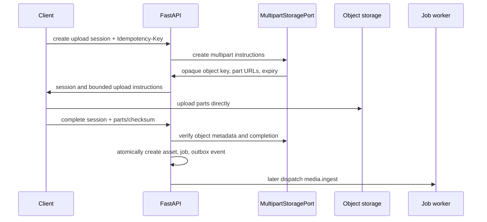

# Direct Media Upload Architecture

## Goal

Allow resumable large-media uploads without sending media bytes through FastAPI or n8n. The API owns authorization, intent, state, and verification; an object-storage adapter owns provider-specific multipart instructions.

## Upload lifecycle

## States

`created → uploading → uploaded → validating → processing → ready` is the eventual media lifecycle. Phase 0 implements only session creation, direct transfer coordination, completion verification, `uploaded`, and the creation of a pending ingest job. `rejected`, `quarantined`, `deleted`, and `purging` are reserved states with no Phase 0 processing implementation.

## Required contract

- Create requests include declared media type, byte size, SHA-256 checksum, and allowed multipart parameters; validation checks plan/tenant size policy before adapter invocation.
- Adapter responses contain only short-lived, least-privilege upload instructions. They are never logged, stored in audit details, or returned after expiry.
- Object keys are generated server-side: `tenant/{business_id}/media/{asset_id}/original/{opaque-name}`. Original objects are immutable after completion.
- Complete requests include upload/session IDs, part eTags or equivalent, checksum, and metadata assertions. The adapter verifies provider-side completion and metadata; the server does not trust client declarations.
- Completion is authorized, stateful, and idempotent. A duplicate with the same key returns the original result; conflicting payloads fail.
- The transaction creates the media asset, durable ingest job, audit entry where required, and `media.upload_completed` outbox event together.

## Security boundaries

Filename and media-embedded text are untrusted. Phase 0 does not claim content safety from client MIME alone. Later ingestion must inspect content, enforce size/type limits, scan malware, use isolated parsers/FFmpeg, and quarantine failures before any AI or publication use.

## Adapter boundary

The domain depends on a provider-neutral `MultipartStoragePort` with operations such as create session, list/verify parts, finalize, inspect metadata, and revoke/expire session. Slice 0C may use a local fake or MinIO-compatible implementation. S3, R2, Azure, or another production provider remains a later adapter decision; no provider object types leak into entities, use cases, or API schemas.
