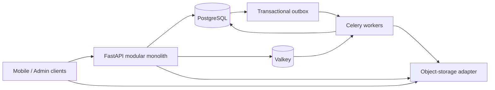

# System Overview

## Purpose

SocialPilot AI starts as a modular monolith: one FastAPI codebase and one PostgreSQL system of record, with isolated worker processes for asynchronous work. This preserves transactional domain boundaries while allowing expensive and failure-prone work to run outside request handling.

## Phase 0 topology

The client requests a constrained upload session from the API, transfers media directly to object storage, then sends a completion command. FastAPI and n8n never receive large media bytes. Slice 0C defines the provider-neutral storage port and may use a local fake or MinIO-compatible adapter; production provider selection, credentials, and connection are outside Slice 0C.

## Runtime responsibilities

| Runtime | Responsibility | Must not own |
|---|---|---|
| FastAPI API | Authentication boundary, authorization, validation, use-case invocation, OpenAPI, dependency readiness | Business rules in controllers or media-byte proxying |
| PostgreSQL | Authoritative domain state, durable jobs, audit records, idempotency state, outbox rows | Queue-only transient state |
| Valkey/Celery | Dispatch and execute bounded background work | Source-of-truth domain state |
| Worker | Execute use-case commands, track attempts/timeout/correlation/dead-letter status | Bypass tenant or authorization checks |
| Object-storage adapter | Create multipart instructions and verify completed-object metadata | Domain policy or credential exposure |
| n8n (later) | External workflow coordination and notifications | Domain state, authorization, money decisions, binary media transfer |

## Runtime images and deployment topology

The single-server topology is [ADR-013](../adr/ADR-013-single-server-deployment-topology.md); the
image line and the backup runner that runs on it are
[ADR-019](../adr/ADR-019-runtime-image-baseline-and-backup-runner.md). Versions live in
`compose.yaml` and `.github/workflows/verify.yml`, which are kept identical on purpose — CI
running a different server version than development would make a green build mean less than it
looks like it means.

| Runtime | Image | Verified |
|---|---|---|
| PostgreSQL | `postgres:18.4-alpine` | 2026-08-04 — 18.4 is the current stable line; 19 is beta |
| Broker/cache | `valkey/valkey:9.1.1-alpine` | 2026-08-04 — BSD-3, replaces AGPL Redis 8 (ADR-010) |
| Object storage (dev only) | `minio/minio:RELEASE.2025-04-22T22-12-26Z` | production uses zero-egress R2 |
| API / worker / beat | `python:3.13-slim` (`runtime` stage) | matches `requires-python` and `uv.lock` |
| Backup runner | `runtime` + `postgresql-client-18` + `openssl` (`backup` stage) | separate image; the API image carries no database client |

Two operational consequences worth carrying into any deployment work:

- **PostgreSQL 18's image moved `PGDATA`** to `/var/lib/postgresql/18/docker` and declares the
  volume one level up. A volume still mounted at the 16-era `/var/lib/postgresql/data` gives an
  empty, silently re-initialised database rather than an error.
- **A major version bump is not an image bump.** The 18 server will not start on a 17 data
  directory; the production procedure is
  [runbooks/postgres-major-upgrade.md](../runbooks/postgres-major-upgrade.md).

## Core boundaries

- **Identity:** Slice 0B introduces a provider-neutral port and test adapter that converts a verified subject into an internal principal. Actual Firebase/OIDC or other production-provider wiring is deferred until after Slice 0B.
- **Tenant:** a business is the operational tenant. Membership and permission checks authorize access to every business resource.
- **Domain modules:** identity, businesses, media, jobs, outbox, idempotency, and audit each own use cases and persistence mappings.
- **Adapters:** storage, identity, provider, and n8n adapters are replaceable infrastructure implementations. Domain services never import a provider SDK.

## Data and event consistency

Use cases update PostgreSQL state and insert an outbox event in one transaction. A worker publishes unprocessed events after commit with retries and an inbox/idempotency discipline at consumers. Direct synchronous calls are reserved for bounded dependency checks and adapter commands that do not replace the outbox guarantee.

## Non-goals for this phase

The diagram deliberately excludes AI, FFmpeg, social/ad platforms, billing, the Slice 0A admin web panel, and production storage/identity providers. These are later adapters or separately scoped work that must conform to the boundaries established here.
