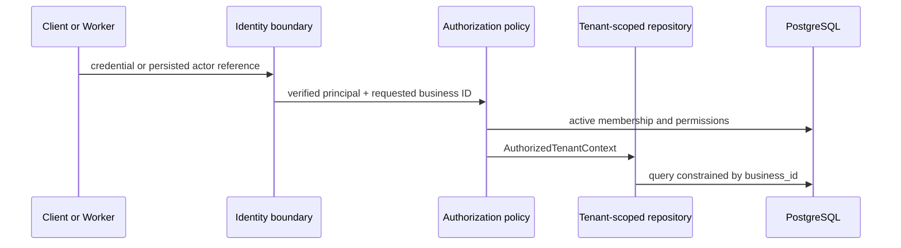

# Tenant Isolation

## Tenant definition

`Business` is the tenant for operational data. A user may belong to multiple businesses, but a request or job operates in exactly one authorized business context. Global identity data (`users`, `external_identities`) is not business-scoped; all business-owned records are.

## Authorization flow

Route parameters are inputs, not authority. The application constructs `AuthorizedTenantContext` only after verifying an active membership and required permission. For inaccessible tenant-owned resources, return `404` to avoid existence disclosure; use `403` when the resource is in an authorized tenant but the actor lacks the required action.

## Mandatory data controls

- Every business-owned table includes non-null `business_id`, an index beginning with it where access is tenant-filtered, and foreign-key integrity where applicable.
- Repositories require a tenant context or explicit `business_id` parameter. There is no general-purpose `list_all()` method for tenant tables.
- Unique keys are tenant-aware when the business semantics allow repeated values across tenants.
- Jobs, attempts, outbox events, idempotency entries, audit records, storage object paths, and log context carry the authorized business ID.
- Background handlers reload the target resource through the tenant-scoped repository and validate state before acting.
- PostgreSQL row-level security can be evaluated as defense in depth after the application-level contract and tests are established; it cannot replace authorization.

## Role baseline

| Role | Business read | Content/media write | Membership management | Billing/tenant deletion |
|---|---:|---:|---:|---:|
| Owner | Yes | Yes | Yes | Yes |
| Admin | Yes | Yes | Yes, policy-limited | No |
| Editor | Yes | Yes | No | No |
| Viewer | Yes | No | No | No |
| Approver | Approval resources only | Approval decision only | No | No |

Exact permission names must be stable application contracts, separate from display labels. Future ad/billing privileges remain unavailable until their modules exist.

## Isolation test matrix

- Two businesses and two users: prevent every read, write, session completion, job lookup, audit lookup, and event replay across the boundary.
- One multi-business user: require an explicit authorized business context and verify no data from the other membership leaks.
- Removed/suspended member: reject new requests and re-check queued work before side effects.
- Malformed/guessed UUIDs: return the same non-disclosing response as another tenant's resource.
- Administrator/support access: requires an explicitly documented, audited, time-bounded impersonation capability; it is not part of the Phase 0 normal path.
