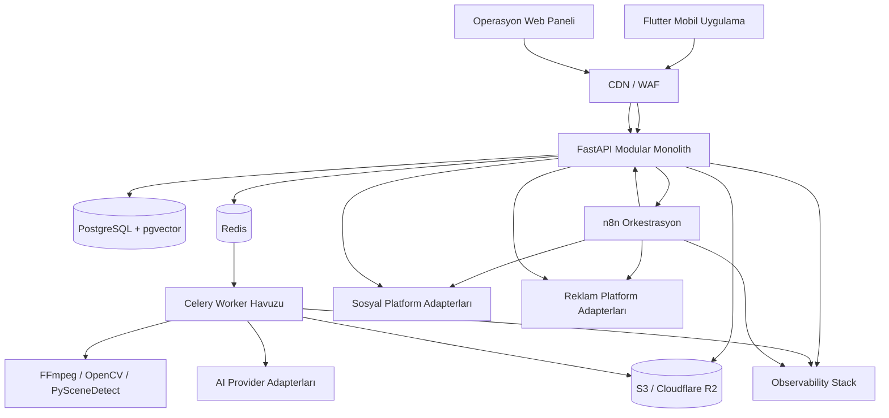
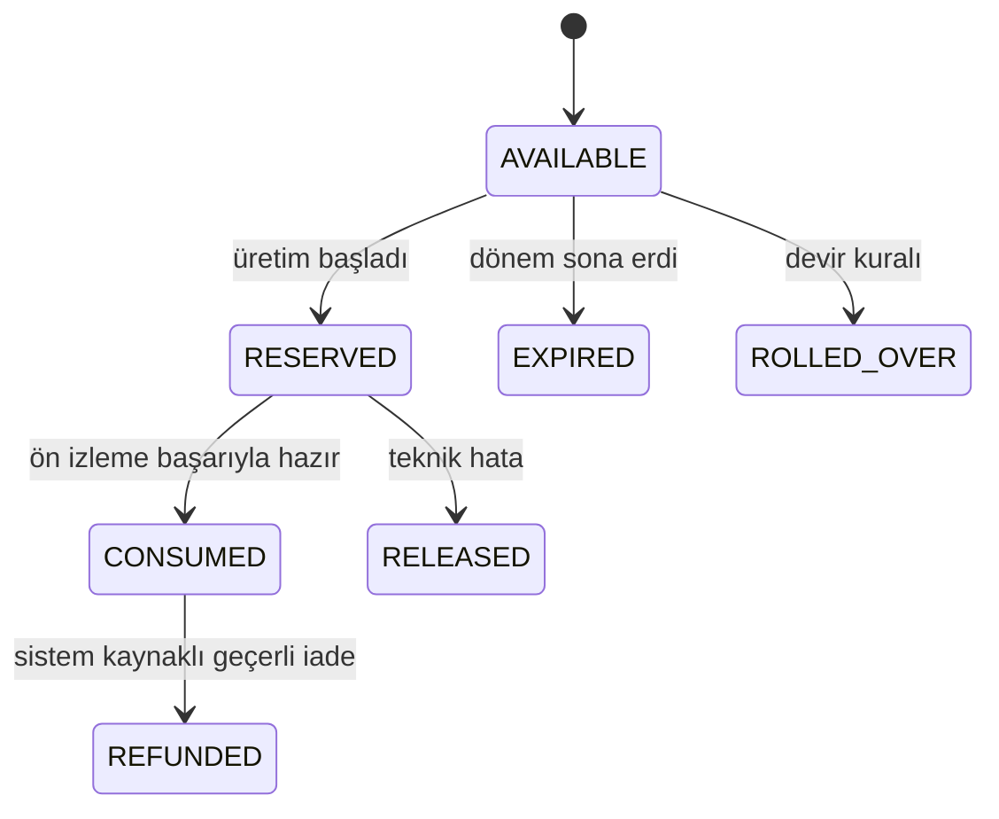
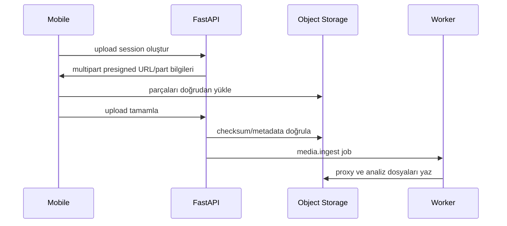
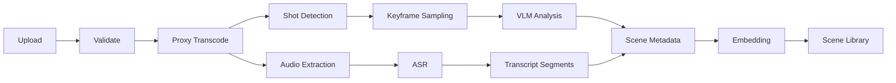
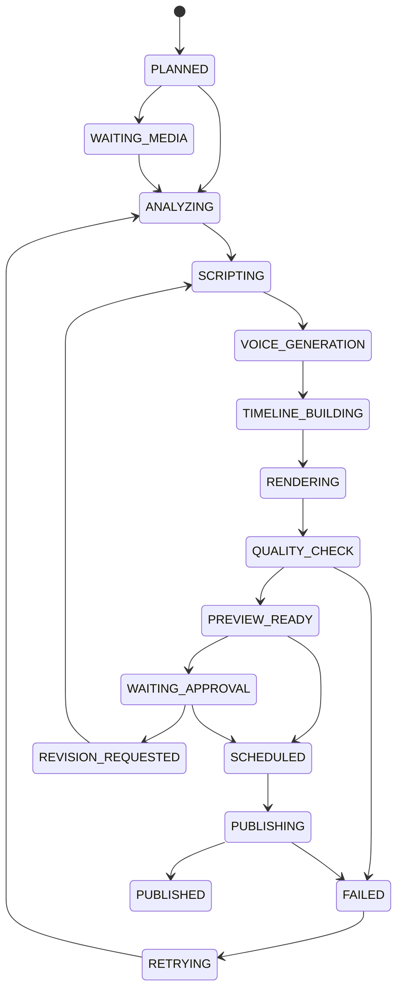

# AI Destekli Otonom Sosyal Medya ve Reklam Yönetim Platformu

**Belge türü:** Ürün Gereksinimleri + Teknik Tasarım + Uygulama Planı  
**Hedef okuyucu:** Codex, Claude Code, yazılım mimarı, backend/mobile geliştirici, DevOps ve ürün ekibi  
**Belge tarihi:** 27 Temmuz 2026  
**Belge sürümü:** 1.0  
**Çalışma adı:** `SocialPilot AI`  
**Ana dil:** Türkçe  
**Hedef istemciler:** iOS ve Android mobil uygulama, operasyon ekibi için web yönetim paneli

---

## 0. Belgenin kullanım talimatı

Bu belge fikir özeti değildir. Uygulamanın ilk üretim sürümünü geliştirmek için kaynak dokümandır.

Codex veya Claude Code bu belgeyi kullanırken:

1. Önce tamamını okumalıdır.
2. Mimari kararları değiştirmeden önce bir ADR (Architecture Decision Record) oluşturmalıdır.
3. Sistemi tek seferde kurmaya çalışmamalıdır.
4. Her aşamada çalışan bir dikey dilim üretmelidir.
5. Her modül için migration, API, servis, test, hata kodu ve gözlemlenebilirlik eklemelidir.
6. Üçüncü taraf sağlayıcıları doğrudan iş mantığına gömmemelidir.
7. Her dış servis için adapter/interface kullanmalıdır.
8. Para harcatan reklam işlemlerinde idempotency, onay ve bütçe guardrail katmanlarını atlamamalıdır.
9. API anahtarlarını mobil uygulamaya, git deposuna veya n8n workflow JSON’una düz metin olarak koymamalıdır.
10. Bu belgedeki platform ve model isimlerini değişebilir kabul etmeli; kabiliyet tabanlı yönlendirme kullanmalıdır.

---

# 1. Ürün vizyonu

Uygulama; küçük ve orta ölçekli işletmelerin fotoğraf, video, ürün, hizmet, marka ve kampanya bilgilerini öğrenerek sosyal medya içeriklerini üretir, düzenler, planlar, yayınlar, reklam kampanyalarını kullanıcının belirlediği sınırlar içinde oluşturur ve performansa göre optimize eder.

Temel vaat:

> İşletmeni tanıt, fotoğraf ve videolarını yükle, paylaşım ve reklam sınırlarını belirle. Sistem içerikleri hazırlasın, videoları profesyonel şekilde kurgulasın, paylaşsın ve reklam bütçesini verdiğin kurallar içinde yönetsin.

Ürün yalnızca bir “AI post üretici” değildir. Ürün şu beş sistemin birleşimidir:

1. **Marka hafızası**
2. **Medya analiz ve video kurgu motoru**
3. **Esnek abonelik ve kullanım hakkı motoru**
4. **Çoklu platform yayınlama ve reklam yönetimi**
5. **Performanstan öğrenen karar sistemi**

---

# 2. Ürün prensipleri

## 2.1 İnsan kontrolü

- Sistem varsayılan olarak kullanıcı onayıyla çalışır.
- Kullanıcı isterse günlük rutin içerikleri otomatikleştirebilir.
- Fiyat, indirim, stok, adres, sağlık iddiası ve yasal beyan gibi kritik bilgiler AI tarafından uydurulamaz.
- Reklam kampanyaları ilk oluşturulduğunda `PAUSED` durumda açılır.
- Tam otomatik reklam modu güvenilir veri oluşmadan aktif edilemez.

## 2.2 Kaynak doğruluğu

- Marka ve ürün verileri doğrulanmış kayıtlar üzerinden kullanılır.
- AI çıktısı gerçek veriyle çelişirse gerçek veri kazanır.
- Kampanya bitiş tarihi geçmişse içerik yayınlanamaz.
- Stok entegrasyonu varsa stokta olmayan ürün için satış reklamı açılamaz.

## 2.3 Sağlayıcı bağımsızlığı

- Qwen, DeepSeek, MiniMax, Seedance, Kling, OpenAI veya başka modeller doğrudan domain koduna yazılmaz.
- Kod `video_understanding`, `script_generation`, `tts`, `image_edit`, `video_generation` gibi kabiliyetleri çağırır.
- Model kimlikleri veritabanındaki veya konfigürasyondaki route kayıtlarından seçilir.
- Her kabiliyet için birincil, ikincil ve acil durum sağlayıcısı tanımlanabilir.

## 2.4 Güvenli otomasyon

- AI reklam bütçesini sınırsız artıramaz.
- Platformlar arası bütçe aktarımı kullanıcı sınırlarına tabidir.
- Harcama işlemlerinde sunucu taraflı bütçe defteri tutulur.
- Aynı kampanyanın tekrar oluşturulmasını engellemek için idempotency zorunludur.
- Tüm reklam değişiklikleri audit log’a yazılır.

## 2.5 Mobil öncelikli deneyim

- Kullanıcı işini büyük ölçüde telefondan yapabilmelidir.
- Uzun video yüklemeleri devam ettirilebilir/resumable olmalıdır.
- Uygulama kapanınca yükleme ve iş durumu kaybolmamalıdır.
- Ön izleme düşük çözünürlüklü proxy üzerinden hızlı açılmalıdır.
- Render veya analiz işlemleri mobil cihazda değil sunucuda yapılmalıdır.

---

# 3. Kapsam

## 3.1 İlk üretim kapsamı

- iOS ve Android mobil uygulama
- E-posta, Google ve Apple ile giriş
- Bir kullanıcı altında bir veya birden fazla işletme
- İşletme ve marka profili
- Fotoğraf ve çoklu video yükleme
- Video sahne analizi
- Konuşma çözümleme ve altyazı
- Çoklu videodan kesit seçme ve birleştirme
- AI senaryo ve seslendirme
- Reels, hikâye, post, carousel ve X gönderisi
- Esnek abonelik oluşturucu
- Kullanım hakkı/entitlement takibi
- İçerik takvimi
- Kullanıcı onayı
- Instagram/Meta ve X içerik yayınlama
- Meta Ads, Google Ads ve X Ads hesap bağlantısı
- Güvenli reklam kampanyası oluşturma
- Günlük performans toplama
- Bildirimler
- Operasyon yönetim paneli
- n8n tabanlı iş otomasyonları
- FastAPI ve worker tabanlı medya işleme

## 3.2 Sonraki aşama

- YouTube Shorts yayınlama
- Google Business Profile yönetimi
- Merchant Center ve ürün feed entegrasyonu
- TikTok bağlantısı
- CRM entegrasyonları
- E-ticaret stok ve sipariş entegrasyonları
- Tam otomatik bütçe dağıtımı
- Ajans/white-label paneli
- Markaya özel onaylı ses klonlama
- İnsan editör pazaryeri
- Çok dilli küresel kullanım
- C2PA/içerik kimlik doğrulama

## 3.3 MVP dışında bırakılacaklar

- Sıfırdan tam teşekküllü mobil video editörü
- Kullanıcının zaman çizelgesinde kare kare manuel montaj yapması
- Lisanssız müzik kütüphanesi
- Politik reklamlar
- Sağlık, finans, kredi, bahis veya hukuki açıdan yüksek riskli reklam kategorileri
- Kullanıcının açık onayı olmadan ses klonlama
- Tanınmış kişilerin yüz/ses taklidi
- Kullanıcının reklam hesabındaki mevcut tüm kampanyaları kontrolsüz değiştirmek

---

# 4. Kullanıcı tipleri ve roller

## 4.1 Son kullanıcı rolleri

### Owner

- İşletme sahibi
- Aboneliği ve faturalandırmayı yönetir
- Sosyal/reklam hesaplarını bağlar
- Reklam bütçesi sınırlarını belirler
- Üye ekler ve çıkarır
- İşletmeyi silebilir

### Admin

- Marka ve içerik ayarlarını yönetir
- İçerikleri onaylar
- Kampanyaları görüntüler ve sınırlar dahilinde yönetir
- Faturalandırma yöntemini değiştiremez; owner izni gerekir

### Editor

- Medya yükler
- İçerik üretir
- Revizyon ister
- Taslak oluşturur
- Reklam bütçesini değiştiremez

### Viewer

- Takvim, içerik ve raporları görüntüler
- Değişiklik yapamaz

### Approver

- Yalnızca onay bekleyen içerik ve reklamları onaylar/reddeder
- Kurumsal müşteriler için ayrı rol olarak kullanılabilir

## 4.2 İç operasyon rolleri

- `support_agent`
- `content_operator`
- `ads_operator`
- `finance_admin`
- `system_admin`
- `security_auditor`

Operasyon kullanıcısı son kullanıcı hesabına doğrudan giriş yapmamalıdır. Destek amaçlı impersonation gerekiyorsa:

- açık sebep yazılmalı,
- süre sınırlı olmalı,
- kullanıcıya bildirim opsiyonu bulunmalı,
- tüm işlemler audit log’a kaydedilmelidir.

---

# 5. Domain sözlüğü

| Terim | Anlam |
|---|---|
| Business | Uygulamada yönetilen işletme/marka |
| Brand Profile | Markanın kimliği, tonu, renkleri, hedef kitlesi ve kuralları |
| Media Asset | Kullanıcının yüklediği fotoğraf, video veya ses |
| Scene | Bir videonun zaman aralığıyla tanımlanmış anlamlı kesiti |
| Content Obligation | Aboneliğe göre belirli zamanda üretilmesi gereken içerik görevi |
| Content Project | Bir içeriğin üretim sürecinin tamamı |
| Content Version | İçeriğin senaryo, kurgu veya metin revizyonu |
| Entitlement | Kullanıcının satın aldığı kullanım hakkı |
| Entitlement Window | Günlük, haftalık veya aylık hak dönemi |
| Usage Reservation | Üretim başlarken geçici olarak ayrılan hak |
| Usage Event | Hak tüketimi, iadesi, devri veya süresinin dolması |
| Connected Account | Instagram, Meta Ads, Google Ads veya X hesabı bağlantısı |
| Campaign Blueprint | Platform bağımsız reklam kampanyası planı |
| Provider Adapter | Dış AI, sosyal medya veya reklam API’sini soyutlayan kod |
| Timeline | Render motoruna gönderilen kesit, ses, metin ve efekt planı |
| Guardrail | Bütçe, içerik, politika veya yetki güvenlik kuralı |
| Automation Mode | Manuel, onaylı, yarı otomatik veya tam otomatik çalışma seviyesi |

---

# 6. Yüksek seviyeli sistem mimarisi



## 6.1 Mimari yaklaşım

İlk sürümde mikroservis kullanılmamalıdır. **Modüler monolit + bağımsız worker süreçleri** kullanılmalıdır.

Neden:

- Domain karmaşık, ekip başlangıçta küçük olacaktır.
- Transaction sınırlarını korumak daha kolaydır.
- Kod ve veri modeli daha hızlı evrilir.
- Ağ üzerinden gereksiz servis bağımlılığı oluşmaz.
- Ağır medya işleri API sürecinden ayrılabilir.

Aşağıdakiler ayrı çalıştırılabilir süreçlerdir:

- `api`
- `scheduler`
- `worker-media-analysis`
- `worker-render`
- `worker-ai`
- `worker-publishing`
- `worker-ads`
- `n8n`
- `admin-web`

İleride yük artınca domain modülleri servisleştirilebilir.

---

# 7. Önerilen teknoloji yığını

## 7.1 Mobil

- Flutter
- Riverpod
- go_router
- Dio
- freezed + json_serializable
- flutter_secure_storage
- Drift veya eşdeğer yerel SQL katmanı
- video_player
- image_picker/file_picker
- Firebase Cloud Messaging
- Firebase Authentication
- Sentry Flutter
- resumable multipart upload client

## 7.2 Backend

- Python
- FastAPI
- Pydantic v2
- SQLAlchemy 2
- Alembic
- PostgreSQL
- pgvector
- Redis
- Celery
- httpx
- tenacity
- structlog
- OpenTelemetry
- FFmpeg
- ffprobe
- OpenCV
- PySceneDetect

## 7.3 Web admin

- Next.js
- TypeScript
- TanStack Query
- React Hook Form
- Zod
- Yetki kontrollü internal admin UI

## 7.4 Altyapı

- Docker
- Docker Compose: yerel geliştirme
- Terraform: üretim altyapısı
- Kubernetes/ECS/benzeri: ölçek aşaması
- S3 veya Cloudflare R2
- Cloudflare CDN/WAF
- Vault veya cloud secret manager
- GitHub Actions
- Sentry
- Prometheus + Grafana
- Loki veya yönetilen log servisi

## 7.5 Orkestrasyon

- n8n: zamanlama, entegrasyon, bildirim ve iş akışı koordinasyonu
- Celery + Redis: ağır ve asenkron uygulama işleri
- PostgreSQL: iş durumunun ve domain gerçekliğinin tek kaynağı

---

# 8. Kaynak kod deposu

```text
socialpilot-ai/
├── apps/
│   ├── mobile/
│   └── admin-web/
├── services/
│   ├── api/
│   │   ├── app/
│   │   │   ├── core/
│   │   │   ├── modules/
│   │   │   │   ├── identity/
│   │   │   │   ├── businesses/
│   │   │   │   ├── brands/
│   │   │   │   ├── media/
│   │   │   │   ├── content/
│   │   │   │   ├── subscriptions/
│   │   │   │   ├── billing/
│   │   │   │   ├── connectors/
│   │   │   │   ├── publishing/
│   │   │   │   ├── advertising/
│   │   │   │   ├── analytics/
│   │   │   │   ├── notifications/
│   │   │   │   └── admin/
│   │   │   ├── adapters/
│   │   │   │   ├── ai/
│   │   │   │   ├── social/
│   │   │   │   ├── ads/
│   │   │   │   ├── billing/
│   │   │   │   ├── storage/
│   │   │   │   └── notifications/
│   │   │   └── main.py
│   │   └── tests/
│   ├── workers/
│   │   ├── media_analysis/
│   │   ├── ai_generation/
│   │   ├── rendering/
│   │   ├── publishing/
│   │   └── advertising/
│   └── scheduler/
├── packages/
│   ├── contracts/
│   ├── domain-events/
│   ├── prompt-schemas/
│   ├── timeline-schema/
│   └── test-fixtures/
├── workflows/
│   └── n8n/
├── infra/
│   ├── docker/
│   ├── terraform/
│   ├── kubernetes/
│   └── monitoring/
├── docs/
│   ├── adr/
│   ├── api/
│   ├── runbooks/
│   └── security/
├── scripts/
├── .github/workflows/
└── README.md
```

---

# 9. Mobil uygulama bilgi mimarisi

Ana menü:

```text
Ana Sayfa
Takvim
Oluştur
Medya
Reklamlar
Profil
```

## 9.1 Ana Sayfa

Kartlar:

- Bugün yayınlanacak içerikler
- Onay bekleyen içerikler
- Kalan kullanım hakları
- Aktif reklam harcaması
- Bağlantısı kopmuş hesaplar
- Eksik çekim önerileri
- Haftalık performans özeti
- AI önerileri
- Son üretim hataları

## 9.2 Takvim

- Gün/hafta/ay görünümü
- Platform ikonları
- İçerik türü
- Durum
- Yayın saati
- Onay durumu
- Sürükle-bırak yeniden planlama
- Tatil/kampanya katmanı
- Filtre: Instagram, X, reklam, organik, onay bekliyor

## 9.3 Oluştur

- Reels
- Premium video
- Hikâye
- Carousel
- Instagram postu
- X gönderisi
- X thread
- Kampanya kreatifi
- Meta reklamı
- Google Search kampanyası
- X reklamı
- Otomatik içerik öner

## 9.4 Medya

- Fotoğraflar
- Videolar
- Ses kayıtları
- Ürün klasörleri
- Mekân klasörleri
- Çalışan/yüz içeren içerikler
- Kullanılmış/kullanılmamış
- Kalite puanları
- AI etiketleri
- Eksik çekimler
- Silinenler
- Yükleme kuyruğu

## 9.5 Reklamlar

- Toplam günlük/aylık harcama
- Aktif kampanyalar
- Onay bekleyen kampanyalar
- Platform dağılımı
- ROAS/CPL/CPA
- Bütçe guardrail durumu
- Durdurulan kampanyalar
- AI optimizasyon aksiyonları
- Acil durdurma

## 9.6 Profil

- Kullanıcı profili
- İşletme seçici
- Marka profili
- Ekip üyeleri
- Bağlı hesaplar
- Abonelik ve haklar
- Faturalandırma
- Otomasyon tercihleri
- Bildirim ayarları
- Veri ve gizlilik
- Destek
- Hesap silme

---

# 10. Onboarding akışı

```mermaid
flowchart LR
    A[Kayıt] --> B[İşletme oluştur]
    B --> C[Sektör seç]
    C --> D[Marka bilgileri]
    D --> E[Ürün ve hizmetler]
    E --> F[Logo, renk, medya]
    F --> G[Sosyal hesap bağlantıları]
    G --> H[Abonelik oluşturucu]
    H --> I[Otomasyon seviyesi]
    I --> J[İlk haftalık plan]
    J --> K[İlk içerik üretimi]
```



## 10.1 Kayıt

Desteklenecek girişler:

- E-posta ve şifre
- Google Sign-In
- Sign in with Apple
- Daha sonra telefon OTP

Giriş hesabı ile sosyal medya bağlantısı ayrı kavramlardır. Kullanıcı Google ile giriş yapmış olsa bile Google Ads hesabını ayrıca OAuth ile bağlar.

## 10.2 İşletme oluşturma

Alanlar:

- Ticari ad
- Görünen marka adı
- Sektör
- Alt sektör
- Ülke
- Şehir
- Saat dilimi
- Para birimi
- Dil
- Web sitesi
- Telefon
- Adresler/şubeler
- Vergi/fatura bilgileri ayrı güvenli alanda

## 10.3 Marka sihirbazı

- Marka açıklaması
- Değer önerisi
- Ürün/hizmetler
- Hedef kitleler
- Rakipler
- Marka kişiliği
- İletişim tonu
- Renk paleti
- Logo
- Yazı tipi tercihi
- Kullanılması gereken kelimeler
- Yasak kelimeler
- Yasak konular
- Onaylı CTA listesi
- Yasal dipnotlar
- Fiyat ve kampanya veri kaynağı
- Görsel stil örnekleri
- Beğenilen/beğenilmeyen örnekler

## 10.4 Marka sağlık skoru

Skor bileşenleri:

- İşletme bilgisi tamamlanma
- Logo ve renk seti
- En az bir ürün/hizmet
- Hedef kitle
- Ton kuralları
- En az beş fotoğraf
- En az üç kullanılabilir video
- Bağlı sosyal hesap
- Yayın saatleri
- Kampanya verisi
- Reklam dönüşüm takibi

Skor tavsiye amaçlıdır; kullanıcıyı engellememelidir. Kritik eksik varsa ilgili senaryo engellenebilir.

---

# 11. İşletme ve marka profili

## 11.1 İşletme profili bölümleri

1. Genel bilgiler
2. Şubeler
3. Ürün/hizmet kataloğu
4. Marka kimliği
5. Hedef kitle
6. İçerik politikaları
7. Reklam politikaları
8. Kampanyalar
9. Bağlı hesaplar
10. Ekip
11. Onay akışları

## 11.2 Ürün/hizmet kaydı

Her ürün:

```json
{
  "id": "uuid",
  "name": "Soğuk Latte",
  "category": "İçecek",
  "description": "Soğuk süt ve çift espresso",
  "price_minor": 16500,
  "currency": "TRY",
  "status": "active",
  "stock_status": "available",
  "valid_locations": ["kadikoy"],
  "claims": ["taze hazırlanır"],
  "forbidden_claims": ["sağlığa iyi gelir"],
  "media_asset_ids": [],
  "landing_page_url": null
}
```

Fiyatlar `minor unit` olarak tutulmalıdır. Örneğin `16500 = ₺165,00`.

## 11.3 Kampanya kaydı

- Kampanya adı
- Başlangıç/bitiş
- Ürünler
- İndirim türü
- İndirim değeri
- Geçerli şubeler
- Stok limiti
- Kupon kodu
- Yasal metin
- Reklam bütçesi
- Onay durumu
- Otomatik durdurma koşulları

AI kampanya tarihini veya fiyatı yazmaz. Doğrulanmış kayıttan alır.

---

# 12. Esnek abonelik modeli

## 12.1 Kullanıcı deneyimi

Kullanıcı hazır paket veya “Kendi Paketini Oluştur” seçeneğini seçer.

Örnek seçim:

```text
Instagram Reels: Her gün 1
Instagram hikâye: Her gün 2
Instagram carousel: Haftada 1
Premium video: Haftada 1
X gönderisi: Hafta içi her gün 1
X thread: Haftada 1
Reklam kreatifi: Ayda 4
Meta + Google reklam yönetimi: Aktif
Otomasyon: Yarı otomatik
```

## 12.2 Abonelik kalemi şeması

```json
{
  "content_type": "instagram_reels",
  "platform": "instagram",
  "frequency": {
    "unit": "day",
    "count": 1,
    "active_days": ["MO", "TU", "WE", "TH", "FR", "SA", "SU"]
  },
  "quality_tier": "professional",
  "automation_mode": "auto_publish",
  "approval_policy": "campaign_only",
  "revision_limit": 1,
  "rollover_policy": "none",
  "preferred_publish_windows": [
    {"start": "18:00", "end": "20:00"}
  ],
  "content_constraints": {
    "max_duration_seconds": 30,
    "voiceover": true,
    "captions": true
  }
}
```

## 12.3 Kalite seviyeleri

### Standard

- Yerel sahne analizi + hızlı VLM
- Standart senaryo
- Standart TTS
- Basit geçişler
- Bir kalite kontrol
- Bir revizyon

### Professional

- Daha güçlü VLM doğrulaması
- Gelişmiş sahne sıralama
- Marka uyumu kontrolü
- Premium TTS
- Çok katmanlı ses miksajı
- İki kalite kontrol
- İki revizyon

### Premium Ad

- Çoklu senaryo varyasyonu
- A/B kreatifleri
- Gerekirse generative B-roll
- Gelişmiş renk/ses düzenleme
- Premium model routing
- Reklam politika ön kontrolü
- Üç revizyon

## 12.4 İçerik puanı/credit sistemi

Mobil mağazalarda her kullanıcı için sınırsız sayıda dinamik abonelik ürünü oluşturmak yönetilemez. Bu nedenle kullanıcı özel kombinasyon oluşturur ancak faturalandırma sınırlı sayıdaki kredi seviyesine eşlenir.

Örnek puanlar:

| İçerik | Puan |
|---|---:|
| X gönderisi | 1 |
| Hikâye | 1 |
| Statik post | 2 |
| Carousel | 3 |
| Standard Reels | 5 |
| Professional Reels | 8 |
| Premium video | 20 |
| Reklam kreatifi varyasyonu | 5 |
| Generative video sahnesi | 10+ |

Aylık ihtiyaç hesaplanır:

```text
Aylık ihtiyaç = içerik sıklığı × içerik puanı × kalite çarpanı
```

Kullanıcı en yakın kredi aboneliğine eşlenir:

```text
Flex 100
Flex 250
Flex 500
Flex 1000
Flex 2000
```

Kalan kredi “esnek hak” olarak kullanılabilir.

Bu yaklaşım iki katmanı ayırır:

- **Store ürünü:** Fiyatlandırma ve tahsilat
- **Sunucu abonelik tanımı:** Kullanıcının gerçek içerik takvimi
- **Entitlement ledger:** Hangi hakların kullanılabildiği

## 12.5 Mobil mağaza ve B2B ayrımı

Dijital içerik/hizmet abonelikleri için mobil mağaza ödeme politikaları dikkate alınmalıdır.

Önerilen strateji:

### Bireysel/KOBİ mobil kullanıcı

- iOS: StoreKit auto-renewable subscription
- Android: Google Play Billing subscription
- Ek tek seferlik içerikler: consumable kredi paketi
- Satın alma sunucuda doğrulanır
- Store bildirimleriyle entitlement güncellenir

### Kurumsal/özel sözleşme

- Web veya satış sözleşmesi üzerinden tanımlanır
- Mobil uygulama yalnızca aktif entitlement’ı gösterir
- Uygulama içinde mağaza kurallarını ihlal edecek dış ödeme yönlendirmesi yapılmaz
- Hukuk ve mağaza incelemesi öncesinde son satın alma akışı doğrulanmalıdır

## 12.6 Hak dönemi

- Günlük
- Haftalık
- Aylık
- Fatura dönemi
- Kampanya dönemi
- Tek seferlik

## 12.7 Hak yaşam döngüsü



## 12.8 Hak tüketme kuralları

Hak, kullanıcı butona bastığında kesin tüketilmez.

1. Hak uygunluğu kontrol edilir.
2. `usage_reservation` açılır.
3. İşlem tamamlanır.
4. Ön izleme ve kalite kontrol başarıysa tüketilir.
5. Teknik hata varsa rezervasyon bırakılır.
6. Kullanıcı tamamen farklı konsept isterse yeni hak gerekebilir.
7. Küçük revizyonlar revizyon kotasından düşer.

## 12.9 Devir politikası

- Günlük içerik hakkı: varsayılan devretmez
- Haftalık premium video: en fazla bir dönem devredebilir
- Aylık esnek kredi: planın belirlediği yüzde kadar devredebilir
- Kullanıcı kaynaklı medya eksikliği: hak geçici ertelenebilir
- Sistem arızası: hak süresi uzatılmalıdır

## 12.10 Abonelik durumları

```text
trialing
active
past_due
grace_period
paused
canceled
expired
refunded
billing_retry
store_mismatch
```

Sunucu tarafı entitlement tek başına mobil istemciye güvenerek açılmaz.

---

# 13. İçerik planlayıcı

## 13.1 Content obligation

Abonelik kalemleri doğrudan içerik oluşturmaz. Scheduler, abonelikten `content_obligation` kayıtları üretir.

Örnek:

```json
{
  "business_id": "uuid",
  "subscription_item_id": "uuid",
  "content_type": "instagram_reels",
  "period_start": "2026-07-27T00:00:00+03:00",
  "period_end": "2026-07-28T00:00:00+03:00",
  "planned_publish_at": "2026-07-27T18:30:00+03:00",
  "generation_deadline_at": "2026-07-27T12:00:00+03:00",
  "status": "planned"
}
```

## 13.2 Planlama öncelikleri

1. Aktif kampanyalar
2. Abonelik zorunlulukları
3. Marka içerik dengesi
4. Geçmiş performans
5. Medya yeterliliği
6. Aynı ürünün fazla tekrarlanmaması
7. Platform ve format uygunluğu
8. Sessiz saatler
9. Kullanıcı tercihleri
10. Özel günler; gerçek zamanlı doğrulama gerekiyorsa web veya doğrulanmış takvim kaynağı

## 13.3 Haftalık içerik karması

Sistem sürekli satış postu üretmemelidir.

Örnek dağılım:

- %25 ürün/hizmet
- %20 eğitici
- %15 marka hikâyesi
- %15 sosyal kanıt
- %10 eğlence/etkileşim
- %10 kampanya
- %5 kurumsal

Bu oran sektör ve kullanıcı ayarına göre değişebilir.

---

# 14. İçerik senaryoları

Her senaryo aşağıdaki ortak contract’a uymalıdır:

```json
{
  "scenario_code": "product_reels",
  "required_inputs": [],
  "optional_inputs": [],
  "selection_rules": [],
  "script_schema": {},
  "timeline_template": {},
  "quality_checks": [],
  "fallback_strategy": [],
  "approval_requirement": "configured"
}
```

## 14.1 Günlük ürün Reels’i

**Amaç:** Ürün görünürlüğü ve satış.

Gerekli medya:

- Ürün yakın planı
- Hazırlık/kullanım
- Sonuç/servis
- Logo veya CTA kartı

Akış:

```text
Ürün seç
→ Aktif fiyat/kampanya doğrula
→ Uygun sahneleri sırala
→ Hook üret
→ 10–30 saniyelik senaryo
→ Seslendirme
→ Timeline
→ Render
→ Marka/fiyat QC
→ Onay/yayın
```

Fallback:

- Yeterli video yoksa fotoğraf tabanlı motion video
- Ürün yakın planı yoksa çekim önerisi
- Kritik medya eksikse düşük kaliteli içerik üretmek yerine görevi beklet

## 14.2 Haftalık premium reklam videosu

- 30–60 saniye
- Çoklu video
- Profesyonel seslendirme
- Gelişmiş hikâye
- Birden fazla ürün veya hizmet
- Gerekirse generative B-roll
- A/B açılış varyasyonu
- Reklam kullanımına uygun hak ve lisans kontrolü

## 14.3 Günlük X gönderisi

Girdiler:

- Marka tonu
- Günün içerik planı
- Ürün/kampanya
- Karakter limiti
- Link/UTM
- Yasak konular

Çıktılar:

- Ana gönderi
- Alternatif varyasyon
- Görsel önerisi
- Gerekirse thread devamı

X paylaşımı ile X reklamı ayrı görevdir.

## 14.4 X thread

- 3–8 gönderi
- Tek ana tema
- İlk gönderide hook
- Son gönderide CTA
- Zincir kimliklerinin sırayla saklanması
- Yarım kalan thread için retry ve cleanup

## 14.5 Hikâye serisi

- 3–5 slide
- 9:16
- Başlık
- Ürün/hizmet
- Sosyal kanıt
- CTA
- Platform sticker alanı bırakılabilir
- Metin safe-area kontrolü

## 14.6 Carousel

- 4–10 sayfa
- Kapak
- Problem
- Çözüm
- Detaylar
- Kanıt
- CTA
- Renk ve tipografi bütünlüğü
- Metin render katmanında yazılır

## 14.7 Konuşmalı video temizleme

- ASR
- Dolgu kelime/sessizlik tespiti
- Jump cut
- Aktif konuşmacı kadrajı
- Otomatik altyazı
- Gürültü azaltma
- Müzik ducking
- Kullanıcının gerçek sesi korunur
- Ek seslendirme varsayılan olarak eklenmez

## 14.8 Seslendirmeli ürün reklamı

- Önce senaryo ve seslendirme oluşturulur
- Ses segment süreleri çıkarılır
- Her cümleye semantik olarak uygun kesit atanır
- Müzik ve ortam sesi seslendirmeye göre kısılır
- CTA sonunda net görünür

## 14.9 Öncesi/sonrası

- `before`, `process`, `after` sahneleri sınıflandırılır
- Tarih/sıra doğrulanır
- Yanıltıcı değişim yaratacak görüntü manipülasyonu yapılmaz
- Sağlık ve güzellik sektörlerinde iddia kuralları sıkılaştırılır

## 14.10 Kurumsal tanıtım

- Dış cephe/tabela
- Ekip
- Süreç
- Müşteri deneyimi
- Mekân
- Değer önerisi
- İletişim
- Logo

## 14.11 Müşteri yorumu

- Kullanım izni kaydı
- Yorumun kaynağı
- İsim/görsel yayın izni
- Abartılı veya değiştirilen anlam olmamalı
- Hassas bilgi redaksiyonu

## 14.12 Eğitici içerik

- Yalnızca doğrulanmış marka bilgisi
- Sağlık/finans/hukuk iddiasında uzman onayı
- Kaynak gerektiren iddialar için yayın engeli veya insan onayı
- CTA zorunlu değildir

## 14.13 Kampanya duyurusu

- Kampanya kaydı zorunlu
- Tarih ve fiyat doğrulaması
- Otomatik bitiş
- Stok bittiğinde durdurma
- Şube geçerliliği

## 14.14 Lansman

Aşamalar:

1. Teaser
2. Tanıtım
3. Lansman günü
4. Satış
5. Yeniden hedefleme
6. Sonuç raporu

## 14.15 Trend uyarlaması

- Trend verisi güncel kaynaktan gelmelidir
- Markaya uygunluk kontrolü
- Telifli ses/müzik otomatik kullanılmamalı
- Marka güvenli değilse trend reddedilmeli
- Kullanıcı “trend içeriklerine izin ver” seçeneğini açmalıdır

## 14.16 Organik kazananı reklama çevirme

- Organik içerik en az belirlenen gözlem süresini tamamlar
- Marka medyanına göre performans karşılaştırılır
- Reklam kullanım hakkı kontrol edilir
- Kullanıcı bütçe kuralları doğrulanır
- Kampanya `PAUSED` oluşturulur
- Onay politikasına göre aktive edilir

---

# 15. Medya yükleme altyapısı

## 15.1 Yükleme akışı

Mobil uygulama medya dosyasını FastAPI veya n8n üzerinden taşımaz.



## 15.2 Gereksinimler

- Multipart/resumable upload
- SHA-256 checksum
- MIME doğrulama
- ffprobe doğrulaması
- Dosya boyutu limiti plan bazlı
- Aynı dosya hash’i ile deduplication
- Ağ kesintisinde devam
- Mobil arka plan yükleme
- Yükleme ilerleme yüzdesi
- İptal
- Virüs/malware taraması
- Dosya adından bağımsız UUID
- Orijinal dosya immutable

## 15.3 Object storage düzeni

```text
tenant/{business_id}/media/{asset_id}/original/source.mp4
tenant/{business_id}/media/{asset_id}/proxy/720p.mp4
tenant/{business_id}/media/{asset_id}/audio/source.wav
tenant/{business_id}/media/{asset_id}/thumbs/0001.jpg
tenant/{business_id}/media/{asset_id}/scenes/{scene_id}.mp4
tenant/{business_id}/content/{project_id}/renders/{version_id}.mp4
tenant/{business_id}/content/{project_id}/captions/{version_id}.vtt
```

## 15.4 Medya durumları

```text
uploading
uploaded
validating
processing
ready
rejected
quarantined
deleted
purging
```

## 15.5 Proxy üretimi

Analiz ve ön izleme için:

- 720p H.264 proxy
- AAC ses
- Normalize edilmiş frame rate
- Fast-start MP4
- Thumbnail strip
- Audio waveform
- Orijinal korunur

AI sağlayıcıya mümkünse orijinal yerine proxy veya seçilmiş sahneler gönderilir.

---

# 16. Video analiz hattı



## 16.1 Yerel analiz

Ücretli API çağrısından önce:

- Süre
- Çözünürlük
- Codec
- FPS
- En-boy oranı
- Parlaklık
- Bulanıklık
- Siyah kare
- Aşırı titreme
- Ses seviyesi
- Sessizlik
- Sahne değişimleri
- Yüz alanı
- Motion score

## 16.2 ASR

Çıktı:

```json
{
  "language": "tr",
  "segments": [
    {
      "start_ms": 2100,
      "end_ms": 5200,
      "text": "Yeni ürünümüz bugün satışta.",
      "confidence": 0.94,
      "speaker": "S1"
    }
  ]
}
```

Gereksinimler:

- Türkçe
- Zaman damgası
- VTT/SRT üretimi
- Gürültülü ortam desteği
- Marka terim sözlüğü
- Düşük confidence segmentlerinde ikinci sağlayıcı
- Kullanıcı düzeltmesiyle sözlük öğrenme

## 16.3 VLM sahne analizi

Her sahne için yapılandırılmış JSON:

```json
{
  "summary": "Barista latte üzerine desen yapıyor",
  "scene_type": "preparation",
  "objects": ["kahve", "fincan", "süt"],
  "people_count": 1,
  "products": ["Soğuk Latte"],
  "brand_logo_visible": false,
  "text_detected": [],
  "quality": {
    "sharpness": 0.88,
    "lighting": 0.82,
    "stability": 0.76,
    "composition": 0.91
  },
  "marketing": {
    "hook_score": 0.84,
    "product_visibility": 0.94,
    "emotion_score": 0.67,
    "cta_suitability": 0.20
  },
  "suitable_scenarios": ["product_reels", "voiceover_ad"],
  "unsafe_flags": []
}
```

## 16.4 Sahne kütüphanesi

Sahneler şu özelliklerle aranabilir:

- Ürün
- Şube
- İnsan var/yok
- Yüz yakın plan
- Hazırlık
- Son ürün
- Mekân
- Dış cephe
- Before/after
- Enerji
- Kalite
- Dikey kadraja uygunluk
- Daha önce kullanım sayısı
- Son kullanım tarihi
- Performans geçmişi

## 16.5 Embedding ve retrieval

- Sahne açıklaması için text embedding
- Keyframe için multimodal embedding, sağlayıcı destekliyorsa
- pgvector
- Marka ve senaryo sorgusuna göre top-k sahne
- Sonuçlar VLM rerank ile doğrulanabilir
- Aynı videodan aşırı sahne seçimini engelleyen diversity penalty

---

# 17. AI model yönlendirme katmanı

## 17.1 Kabiliyetler

```text
text_strategy
script_generation
caption_generation
structured_timeline
video_understanding
scene_rerank
asr
tts
image_generation
image_edit
video_generation
moderation_text
moderation_image
translation
quality_review
```

## 17.2 Önerilen sağlayıcı adayları

Bu liste kod içinde sabitlenmemelidir.

| Görev | Birincil aday | Alternatif |
|---|---|---|
| Video anlama | Qwen VL / Alibaba Model Studio | Gemini veya başka güçlü VLM |
| Metin/planlama | DeepSeek | Qwen / OpenAI |
| ASR | Qwen ASR veya güçlü Türkçe ASR | OpenAI/ElevenLabs/başka |
| TTS | MiniMax Speech HD | ElevenLabs/Qwen TTS |
| Görsel düzenleme | Qwen Image/Edit | OpenAI Image/Seedream |
| Generative video | Seedance | Kling/Hailuo |
| Kalite kontrol | Farklı sağlayıcıdan güçlü model | Birincil sağlayıcı |
| Montaj | FFmpeg | Yönetilen render servisi |

## 17.3 Provider interface

```python
class VideoUnderstandingProvider(Protocol):
    async def analyze_scene(
        self,
        asset_url: str,
        start_ms: int,
        end_ms: int,
        schema: dict,
        context: dict,
    ) -> dict: ...

class TextGenerationProvider(Protocol):
    async def generate_structured(
        self,
        task: str,
        input_data: dict,
        output_schema: dict,
        quality_tier: str,
    ) -> dict: ...

class TTSProvider(Protocol):
    async def synthesize(
        self,
        text: str,
        voice_profile: dict,
        output_format: str,
    ) -> "AudioResult": ...
```

## 17.4 Route seçimi

Girdiler:

- Task
- Quality tier
- Dil
- Medya süresi
- Kullanıcının planı
- Tenant veri bölgesi
- Sağlayıcı sağlık durumu
- Günlük maliyet bütçesi
- Latency hedefi
- Kullanıcının premium seçimi
- Hassas veri politikası

Örnek route:

```json
{
  "capability": "video_understanding",
  "quality_tier": "professional",
  "primary_provider": "alibaba_qwen",
  "primary_model": "configured-model-id",
  "fallbacks": [
    {"provider": "google", "model": "configured-model-id"}
  ],
  "max_cost_minor": 150,
  "timeout_seconds": 180,
  "retry_policy": "transient_only"
}
```

## 17.5 Model çıktısı güvenliği

- JSON Schema doğrulaması
- Zorunlu alanlar
- Enum değerleri
- Maksimum metin uzunluğu
- Prompt injection savunması
- Kullanıcı medyasındaki metin talimat olarak değil veri olarak kabul edilir
- Modelin ürettiği URL doğrudan fetch edilmez
- Fiyat/tarih/telefon gibi değerler deterministik katmanda birleştirilir
- İkinci kalite kontrolü aynı modelden değil farklı sağlayıcıdan yapılabilir

## 17.6 Prompt versiyonlama

Tablo:

```text
prompt_templates
- id
- code
- version
- system_prompt
- user_template
- output_schema
- active
- experiment_group
- created_at
```

Her content version hangi prompt sürümüyle üretildiğini saklamalıdır.

---

# 18. Senaryo, seslendirme ve timeline üretimi

## 18.1 Senaryo contract

```json
{
  "hook": {
    "text": "Bugünün en taze molası hazır.",
    "duration_ms": 2200
  },
  "segments": [
    {
      "purpose": "hook",
      "voice_text": "Bugünün en taze molası hazır.",
      "required_scene_tags": ["product_closeup"],
      "target_duration_ms": 2200
    },
    {
      "purpose": "process",
      "voice_text": "Her sipariş özenle hazırlanıyor.",
      "required_scene_tags": ["preparation"],
      "target_duration_ms": 4500
    }
  ],
  "cta": {
    "text": "Bugün bizi ziyaret et.",
    "source": "approved_cta"
  }
}
```

## 18.2 Timeline schema

```json
{
  "version": "1.0",
  "canvas": {
    "width": 1080,
    "height": 1920,
    "fps": 30,
    "duration_ms": 20000
  },
  "video_tracks": [
    {
      "track": 1,
      "clips": [
        {
          "asset_id": "uuid",
          "source_start_ms": 4200,
          "source_end_ms": 7100,
          "timeline_start_ms": 0,
          "crop_mode": "smart_cover",
          "transition_out": "cut"
        }
      ]
    }
  ],
  "audio_tracks": [
    {
      "type": "voiceover",
      "asset_id": "uuid",
      "gain_db": 0
    },
    {
      "type": "music",
      "asset_id": "uuid",
      "gain_db": -18,
      "duck_under_voice": true
    }
  ],
  "overlays": [
    {
      "type": "text",
      "text_source": "verified_campaign.title",
      "start_ms": 0,
      "end_ms": 3000,
      "safe_area": true
    }
  ],
  "captions": {
    "enabled": true,
    "source": "voiceover",
    "style_id": "brand-caption-v1"
  }
}
```

## 18.3 Timeline doğrulama

Render öncesi:

- Süre taşması
- Asset erişimi
- Kesit zaman aralığı
- Aspect ratio
- Minimum çözünürlük
- Seslendirme süresi
- Metin safe-area
- Kampanya tarihi
- Logo kullanımı
- Yasak kelime
- Müzik lisansı
- Duplicate clip
- Black frame
- Audio clipping

---

# 19. Render altyapısı

## 19.1 FFmpeg worker

Görevler:

- Kesme
- Birleştirme
- Smart crop
- Blur background
- Zoom/pan
- Color normalize
- Logo overlay
- Text overlay
- Subtitle burn-in
- Voiceover
- Music ducking
- Original sound mix
- Loudness normalization
- Thumbnail
- Platform varyantları

## 19.2 Render profilleri

```text
instagram_reels_1080x1920
instagram_story_1080x1920
instagram_feed_1080x1350
instagram_square_1080x1080
x_video_1280x720
x_vertical_1080x1920
preview_540x960
```

Gerçek platform limitleri adapter capability endpoint’inden kontrol edilmelidir.

## 19.3 Worker izolasyonu

- Her render ayrı process/container
- CPU/GPU limiti
- Disk kotası
- Temporary directory cleanup
- Timeout
- Retry yalnızca güvenli adımlarda
- Partial output silme
- Job heartbeat
- Dead-letter queue
- Kaynak URL’ler kısa süreli signed URL

## 19.4 Kalite kontrol

Otomatik QC:

- Video açılıyor mu
- Süre doğru mu
- Ses var mı
- Loudness
- Siyah frame
- Boş/sabit görüntü
- Yazılar kadraj dışında mı
- Logo görünür mü
- Altyazı senkronu
- Fiyat ve tarih kaynağa uyuyor mu
- Hassas/uygunsuz içerik
- Yüz bozulması
- Üretken sahnede ürün şekli değişmiş mi

QC başarısızsa:

- Yeniden render
- Alternatif sahne
- Alternatif sağlayıcı
- İnsan incelemesi
- Kullanıcıdan yeni medya talebi

---

# 20. İçerik proje yaşam döngüsü



Her durum geçişi transactional olarak kaydedilmelidir.

---

# 21. Onay sistemi

## 21.1 Onay politikaları

- `always`
- `campaign_only`
- `price_or_discount_only`
- `ads_only`
- `first_n_contents`
- `low_confidence_only`
- `never_within_guardrails`

## 21.2 Reddetme nedenleri

- Yanlış ürün
- Yanlış fiyat
- Yanlış kesit
- Marka diline uygun değil
- Ses uygun değil
- Müzik uygun değil
- Çok uzun/kısa
- Kalite düşük
- Yeni konsept istiyorum
- Diğer

Reddetme nedeni model öğrenme verisi olarak kullanılabilir ancak kullanıcıya özel kalmalıdır.

## 21.3 Revizyon

Küçük revizyon:

- CTA
- Başlık
- Bir kesit
- Ses
- Müzik
- Altyazı stili

Büyük revizyon:

- İçerik türü değişikliği
- Ürün değişikliği
- Tüm konseptin değişmesi
- Sürenin sınıf değiştirmesi

Küçük/büyük ayrımı kural motoru ve gerektiğinde operasyon tarafından belirlenir.

---

# 22. Sosyal hesap bağlantıları

## 22.1 Bağlantı ilkeleri

- OAuth mobil istemcide başlatılır, backend callback ile tamamlanır
- PKCE/state/nonce
- Tokenlar mobilde saklanmaz
- Access/refresh tokenlar şifreli saklanır
- Minimum scope
- Account seçimi
- Capability keşfi
- Token health check
- Re-authentication
- Bağlantıyı kaldırma
- Veri silme webhook/endpoint’i

## 22.2 Meta/Instagram

Bağlantı sonucu:

- Meta kullanıcı/işletme kimliği
- Facebook Page
- Instagram professional account
- Ad account
- Pixel/Dataset
- Catalog
- İzinler
- Token expiry
- Publishing capability
- Insights capability
- Ads capability

İçerik yayınlama ile reklam yönetimi farklı izin ve capability olarak tutulur.

## 22.3 Google

Tek bir “Google hesabı bağlandı” bayrağı yeterli değildir.

Connector modülleri:

- Google Identity
- Google Ads
- YouTube
- GA4
- Merchant Center
- Business Profile

İlk sürümde Google Ads zorunlu, diğerleri feature flag ile eklenir.

Google Ads için:

- OAuth 2.0
- Developer token
- Manager customer ID
- Customer ID
- Accessible customers
- Conversion actions
- Billing setup/readiness
- Test account desteği

## 22.4 X

Ayrı capability’ler:

- Organik gönderi
- Medya yükleme
- Analytics
- Ads account
- Campaign management
- Web conversions

X Ads API erişiminin ayrıca onay gerektirebileceği kabul edilmelidir. Uygulama erişim yoksa organik gönderi özelliğini çalıştırıp reklamı “bağlantı bekliyor” olarak göstermelidir.

## 22.5 Connected account durumları

```text
pending
connected
limited
expired
revoked
error
reconnect_required
disabled
```

## 22.6 Capability matrisi

```json
{
  "publish_image": true,
  "publish_video": true,
  "publish_story": true,
  "read_insights": true,
  "manage_ads": false,
  "read_ads": true,
  "conversion_tracking": false
}
```

UI yalnızca gerçek capability’leri göstermelidir.

---

# 23. Yayınlama motoru

## 23.1 Publishing adapter

```python
class SocialPublishingProvider(Protocol):
    async def capabilities(self, connection: dict) -> dict: ...
    async def upload_media(self, connection: dict, media: dict) -> dict: ...
    async def create_post(self, connection: dict, payload: dict) -> dict: ...
    async def get_post(self, connection: dict, external_id: str) -> dict: ...
    async def delete_post(self, connection: dict, external_id: str) -> None: ...
```

## 23.2 Yayınlama işi

- Platform
- Account
- Content version
- Scheduled time
- Caption
- Hashtags
- Media variants
- First comment
- UTM
- Idempotency key
- Attempt count
- External IDs
- Error details

## 23.3 Retry kuralları

Retry:

- Timeout
- 429
- Geçici 5xx
- Medya processing bekleniyor

Retry edilmez:

- İzin yok
- Hesap kapalı
- Politika reddi
- Geçersiz medya
- Kullanıcı bağlantıyı kaldırmış

## 23.4 Yayınlama doğrulama

“API başarılı cevap verdi” yayınlandı anlamına gelmeyebilir.

- External media status sorgula
- Post external ID kaydet
- URL kaydet
- İlk metrik toplama işini planla
- Başarısız işte kullanıcıyı bilgilendir
- Aynı postu tekrar oluşturma

---

# 24. Reklam otomasyonu

## 24.1 Ana prensip

AI önerir ve izin verilen sınırlar içinde uygular. Bütçe ve platform gerçekliği backend guardrail motoruyla doğrulanır.

## 24.2 Reklam kullanıcı ayarları

```json
{
  "goals": ["sales", "leads"],
  "platforms": ["meta", "google_ads"],
  "monthly_budget_minor": 2000000,
  "daily_budget_limit_minor": 100000,
  "campaign_budget_limit_minor": 500000,
  "target_locations": ["Istanbul"],
  "age_min": 23,
  "age_max": 50,
  "languages": ["tr"],
  "approval_mode": "semi_automatic",
  "max_cpl_minor": 25000,
  "target_roas": 2.5,
  "budget_change_limit_percent": 20,
  "auto_pause_on_tracking_failure": true,
  "auto_pause_on_site_failure": true,
  "regulated_categories_allowed": false
}
```

Örnek para gösterimleri kullanıcı arayüzünde `tr-TR` formatında olmalıdır: `₺20.000,00`.

## 24.3 Reklam senaryoları

### Marka bilinirliği

- Video/görsel kreatif
- Reach/video views
- Bölge ve hedef kitle
- Frequency kontrolü
- Video izleme metrikleri

### Ürün satışı

- Ürün doğrulama
- Landing page
- Conversion tracking
- Meta sales
- Google Search/Performance Max
- Retargeting

### Lead toplama

- Form veya landing page
- Lead başı maliyet
- CRM webhook
- Spam lead filtreleme
- Offline conversion feedback

### Telefon araması

- Çalışma saatleri
- Call CTA
- Arama dönüşümü
- Mesai dışında durdurma

### Mağaza ziyareti

- Şube konumu
- Yakın çevre
- Açılış saatleri
- Yol tarifi/arama

### Lansman

- Teaser
- Awareness
- Launch
- Conversion
- Retargeting

### Organik kazananı boost etme

- Performans eşiği
- Kullanım hakkı
- Bütçe sınırı
- Kampanya paused oluşturma

### A/B kreatif testi

- Aynı kitle/bütçe
- Tek değişken
- Minimum örnek
- Erken kazanan seçmeme
- İstatistiksel veya kural tabanlı karar

## 24.4 Campaign blueprint

Platform bağımsız kayıt:

```json
{
  "goal": "lead_generation",
  "budget": {
    "type": "daily",
    "amount_minor": 50000,
    "currency": "TRY"
  },
  "schedule": {
    "start_at": "2026-08-01T09:00:00+03:00",
    "end_at": "2026-08-07T23:00:00+03:00"
  },
  "audience": {
    "locations": ["Istanbul"],
    "age_min": 25,
    "age_max": 45,
    "languages": ["tr"]
  },
  "creatives": [],
  "conversion_goal_id": "uuid",
  "guardrails": {
    "max_cpl_minor": 25000,
    "max_daily_spend_minor": 75000
  }
}
```

Adapter bunu platform nesnelerine çevirir.

## 24.5 Kampanya oluşturma sırası

```text
Blueprint oluştur
→ Bağlantı ve yetki doğrula
→ Bütçe ledger kontrolü
→ Dönüşüm takibi doğrula
→ Landing page kontrolü
→ Kreatif QC
→ Platforma PAUSED kampanya oluştur
→ External nesneleri doğrula
→ Kullanıcı/onay politikası
→ ACTIVE
```

## 24.6 Guardrail motoru

Zorunlu kurallar:

- Günlük toplam harcama limiti
- Aylık toplam harcama limiti
- Kampanya başına limit
- Platform başına limit
- Otomatik artış yüzdesi
- Değişiklik cooldown süresi
- Maksimum CPL/CPA
- Minimum ROAS için değerlendirme penceresi
- Yetersiz veri varsa agresif aksiyon yok
- Dönüşüm takibi bozulduysa durdur
- Web sitesi kapalıysa durdur
- Stok yoksa durdur
- Kampanya tarihi bittiyse durdur
- Reklam hesabı para birimi uyuşmazlığı
- Kullanıcı tam otomasyonu kapattıysa yalnızca öneri

## 24.7 Harcama defteri

Platform raporları gecikebilir. Kendi rezervasyon defterimiz bulunmalıdır.

```text
ad_spend_ledger
- business_id
- platform
- campaign_id
- date
- reserved_minor
- reported_spend_minor
- currency
- updated_at
```

Yeni kampanya açmadan önce `reserved + reported` limit kontrolü yapılır.

## 24.8 Optimizasyon aksiyonları

```text
recommend_pause
pause
recommend_budget_decrease
budget_decrease
recommend_budget_increase
budget_increase
replace_creative
start_ab_test
end_ab_test
change_schedule
refresh_audience
```

Her aksiyon:

- Sebep
- Önceki değer
- Yeni değer
- Metrik penceresi
- Güven skoru
- Uygulayan
- Onaylayan
- External API sonucu
- Rollback bilgisi

## 24.9 Acil durdurma

- İşletme bazında
- Platform bazında
- Kampanya bazında
- Global sistem bazında

Acil durdurma n8n’e bağlı olmamalıdır; backend doğrudan adapter çağırabilmelidir.

---

# 25. Performans ve analitik

## 25.1 Organik metrikler

- Impression
- Reach
- Like
- Comment
- Share
- Save
- Profile visit
- Link click
- Video play
- 3-second view
- Completion rate
- Follower growth

## 25.2 Reklam metrikleri

- Spend
- Impression
- Reach
- CPM
- Click
- CTR
- CPC
- Conversion
- CPA
- Lead
- CPL
- Revenue
- ROAS
- Frequency
- Video completion
- Platform learning status

## 25.3 Normalize edilmiş metric modeli

Platform alanları doğrudan UI’a taşınmaz.

```text
metric_definitions
metric_observations
external_metric_mappings
```

```json
{
  "entity_type": "published_post",
  "entity_id": "uuid",
  "metric": "video_completion_rate",
  "value": 0.42,
  "period_start": "...",
  "period_end": "...",
  "source": "instagram",
  "raw_payload_ref": "..."
}
```

## 25.4 Öğrenme döngüsü

- İçerik türü
- Hook tipi
- İnsan yüzü
- Ürün
- Süre
- Ses stili
- Yayın saati
- CTA
- Sahne kategorisi
- Platform
- Hedef kitle

Performans sinyalleri sahne ve içerik özellikleriyle ilişkilendirilir.

İlk aşamada ML modeli yerine kural + istatistik kullanılmalıdır. Yeterli veri oluşmadan “AI öğrendi” iddiası yapılmamalıdır.

---

# 26. n8n kullanım sınırı

## 26.1 n8n’in yapacağı işler

- Zamanlanmış content obligation tetikleme
- Servisler arası webhook koordinasyonu
- E-posta/push operasyon akışları
- Token health check
- Onay hatırlatması
- Sosyal yayınlama zamanlaması
- Reklam raporu toplama tetikleri
- Günlük/haftalık rapor
- Hata eskalasyonu
- Harici CRM webhook
- Operasyon bildirimleri

## 26.2 n8n’in yapmayacağı işler

- Büyük video binary taşıma
- FFmpeg render
- Domain verisinin tek kaynağı olma
- Abonelik ve kredi hesabı
- Reklam bütçe kararı
- Yetkilendirme
- OAuth tokenını düz metin tutma
- Kritik transaction yönetimi
- Model promptlarının tek kaynağı olma

## 26.3 Workflow kataloğu

### Hesap

```text
ACC-01 Meta Connect Callback
ACC-02 Google Ads Connect Callback
ACC-03 X Connect Callback
ACC-04 Token Health Check
ACC-05 Reconnect Notification
ACC-06 Account Capability Refresh
```

### Abonelik

```text
SUB-01 Store Event Intake
SUB-02 Subscription Activated
SUB-03 Entitlement Window Generator
SUB-04 Upgrade/Downgrade
SUB-05 Grace Period
SUB-06 Billing Failure Notification
SUB-07 Pause/Resume
SUB-08 Refund/Revoke
```

### İçerik

```text
CNT-01 Weekly Plan
CNT-02 Daily Obligation Dispatcher
CNT-03 Media Readiness Check
CNT-04 Content Job Start
CNT-05 Approval Notification
CNT-06 Approval Reminder
CNT-07 Auto Publish Dispatcher
CNT-08 Revision Dispatcher
CNT-09 Failed Job Escalation
```

### Reklam

```text
ADS-01 Campaign Blueprint Approval
ADS-02 Campaign Creation Dispatcher
ADS-03 Hourly Spend Guard
ADS-04 Daily Performance Collection
ADS-05 Optimization Recommendation
ADS-06 Approved Optimization Execution
ADS-07 Landing Page Health
ADS-08 Conversion Tracking Health
ADS-09 Emergency Stop
ADS-10 Ad Rejection Handler
```

### Operasyon

```text
OPS-01 Provider Health
OPS-02 Queue Backlog Alert
OPS-03 Daily Cost Report
OPS-04 Storage Usage Alert
OPS-05 Dead Letter Escalation
OPS-06 Security Event Notification
```

## 26.4 n8n payload standardı

```json
{
  "event_id": "uuid",
  "event_type": "content.preview_ready",
  "occurred_at": "ISO-8601",
  "tenant_id": "uuid",
  "aggregate_id": "uuid",
  "correlation_id": "uuid",
  "idempotency_key": "string",
  "payload": {}
}
```

Tüm n8n girişleri imzalı webhook veya private network üzerinden olmalıdır.

---

# 27. Event-driven tasarım

## 27.1 Domain event örnekleri

```text
business.created
brand.updated
media.upload_completed
media.ready
media.analysis_completed
subscription.activated
entitlement.window_created
content.obligation_created
content.job_started
content.preview_ready
content.approved
content.scheduled
content.published
connection.expired
campaign.blueprint_created
campaign.activated
campaign.guardrail_triggered
billing.subscription_changed
```

## 27.2 Transactional outbox

Domain işlemi ile event yayınlama aynı transaction’da güvence altına alınmalıdır.

```text
outbox_events
- id
- event_type
- aggregate_type
- aggregate_id
- payload_json
- occurred_at
- published_at
- retry_count
```

Worker outbox kayıtlarını Redis/n8n webhook’una yollar.

## 27.3 Idempotency

Zorunlu alan:

- Mobil create işlemleri
- Store webhook
- Social publish
- Ad create/update
- Refund
- Usage consume
- n8n webhook

`idempotency_keys` tablosu request hash ve response saklayabilir.

---

# 28. Veritabanı tasarımı

Bütün tablolarda uygun olan yerlerde:

- UUID primary key
- `created_at`
- `updated_at`
- `deleted_at`
- tenant/business scope
- optimistic version
- audit metadata

## 28.1 Identity ve tenant

```text
users
user_identities
user_devices
businesses
business_members
roles
member_roles
business_locations
```

## 28.2 Marka

```text
brand_profiles
brand_assets
brand_colors
brand_fonts
brand_rules
brand_examples
target_audiences
products
product_prices
product_inventory_snapshots
campaign_offers
approved_claims
forbidden_claims
approved_ctas
```

## 28.3 Bağlantılar

```text
connected_accounts
oauth_credentials
connection_capabilities
connection_health_events
external_account_mappings
webhook_subscriptions
```

`oauth_credentials` ayrı şema veya ayrı veritabanında tutulabilir. Alanlar envelope encryption ile şifrelenmelidir.

## 28.4 Medya

```text
media_assets
media_variants
media_upload_sessions
media_processing_jobs
media_scenes
media_keyframes
media_tags
media_embeddings
transcripts
transcript_segments
media_usage_links
media_consent_records
music_assets
music_licenses
```

## 28.5 İçerik

```text
content_templates
content_obligations
content_projects
content_versions
content_scripts
voiceover_assets
content_timelines
render_jobs
render_outputs
quality_checks
approval_requests
approval_decisions
revision_requests
publishing_jobs
published_posts
post_metrics
```

## 28.6 Abonelik ve faturalandırma

```text
plan_catalog
plan_credit_tiers
subscription_quotes
subscriptions
subscription_items
store_products
store_transactions
store_notifications
entitlements
entitlement_windows
usage_reservations
usage_events
credit_ledger
billing_accounts
invoices
refunds
```

## 28.7 Reklam

```text
ad_accounts
advertising_settings
conversion_sources
campaign_blueprints
ad_campaigns
ad_groups
ad_creatives
ad_external_entities
ad_spend_ledger
ad_metrics
optimization_rules
optimization_recommendations
optimization_actions
guardrail_events
landing_page_checks
```

## 28.8 Sistem

```text
jobs
job_attempts
outbox_events
inbox_events
idempotency_keys
audit_logs
notifications
notification_preferences
provider_configs
model_routes
provider_usage
feature_flags
experiments
webhook_events
system_incidents
```

## 28.9 Kritik indexler

- `content_obligations(business_id, planned_publish_at, status)`
- `publishing_jobs(status, scheduled_at)`
- `media_scenes(media_asset_id, start_ms)`
- vector index `media_embeddings.embedding`
- `usage_reservations(entitlement_window_id, status)`
- `ad_spend_ledger(business_id, date, platform)`
- `outbox_events(published_at, occurred_at)`
- `connected_accounts(provider, external_account_id)`
- unique idempotency indexes

## 28.10 Row-level güvenlik

Backend her sorguda business scope uygular. Mümkünse PostgreSQL RLS ek koruma olarak kullanılabilir; tek savunma değildir.

---

# 29. API tasarımı

Base:

```text
/api/v1
```

## 29.1 Ortak kurallar

- JSON
- ISO-8601
- UUID
- Cursor pagination
- Problem Details hata formatı
- `Idempotency-Key`
- `X-Correlation-ID`
- ETag/optimistic locking
- OpenAPI
- API versioning
- Request size limits

## 29.2 Auth ve kullanıcı

```text
GET    /me
PATCH  /me
GET    /me/devices
DELETE /me/devices/{id}
POST   /auth/session/exchange
POST   /auth/logout
DELETE /me
```

## 29.3 İşletmeler

```text
GET    /businesses
POST   /businesses
GET    /businesses/{id}
PATCH  /businesses/{id}
DELETE /businesses/{id}
GET    /businesses/{id}/members
POST   /businesses/{id}/members
PATCH  /businesses/{id}/members/{member_id}
DELETE /businesses/{id}/members/{member_id}
```

## 29.4 Marka

```text
GET    /businesses/{id}/brand
PUT    /businesses/{id}/brand
GET    /businesses/{id}/brand/health
GET    /businesses/{id}/products
POST   /businesses/{id}/products
PATCH  /businesses/{id}/products/{product_id}
GET    /businesses/{id}/campaign-offers
POST   /businesses/{id}/campaign-offers
```

## 29.5 Medya

```text
POST   /businesses/{id}/media/uploads
POST   /businesses/{id}/media/uploads/{session_id}/complete
GET    /businesses/{id}/media
GET    /businesses/{id}/media/{asset_id}
DELETE /businesses/{id}/media/{asset_id}
POST   /businesses/{id}/media/{asset_id}/reanalyze
GET    /businesses/{id}/media/{asset_id}/scenes
PATCH  /businesses/{id}/media/{asset_id}/scenes/{scene_id}
```

## 29.6 İçerik

```text
GET    /businesses/{id}/calendar
GET    /businesses/{id}/content-obligations
POST   /businesses/{id}/content-projects
GET    /businesses/{id}/content-projects/{project_id}
POST   /businesses/{id}/content-projects/{project_id}/generate
POST   /businesses/{id}/content-projects/{project_id}/approve
POST   /businesses/{id}/content-projects/{project_id}/reject
POST   /businesses/{id}/content-projects/{project_id}/revisions
POST   /businesses/{id}/content-projects/{project_id}/schedule
POST   /businesses/{id}/content-projects/{project_id}/publish-now
```

Create örneği:

```json
{
  "scenario": "voiceover_ad",
  "platforms": ["instagram"],
  "product_ids": ["uuid"],
  "media_asset_ids": ["uuid", "uuid"],
  "target_duration_seconds": 20,
  "quality_tier": "professional",
  "use_entitlement": true
}
```

## 29.7 Abonelik

```text
GET    /businesses/{id}/subscription
POST   /businesses/{id}/subscription/quotes
POST   /businesses/{id}/subscription/activate
PATCH  /businesses/{id}/subscription/configuration
POST   /businesses/{id}/subscription/pause
POST   /businesses/{id}/subscription/resume
GET    /businesses/{id}/entitlements
GET    /businesses/{id}/usage
POST   /billing/store/verify
POST   /billing/webhooks/apple
POST   /billing/webhooks/google
```

Quote örneği:

```json
{
  "items": [
    {
      "content_type": "instagram_reels",
      "frequency": {"unit": "day", "count": 1},
      "quality_tier": "professional"
    },
    {
      "content_type": "premium_video",
      "frequency": {"unit": "week", "count": 1},
      "quality_tier": "premium_ad"
    }
  ],
  "automation_mode": "semi_automatic"
}
```

Yanıt:

```json
{
  "monthly_points": 480,
  "recommended_store_tier": "flex_500",
  "included_flexible_points": 20,
  "display_price": "store-provided",
  "warnings": []
}
```

## 29.8 Bağlantılar

```text
GET    /businesses/{id}/connections
POST   /businesses/{id}/connections/{provider}/authorize
GET    /connections/{provider}/callback
POST   /businesses/{id}/connections/{connection_id}/refresh
DELETE /businesses/{id}/connections/{connection_id}
GET    /businesses/{id}/connections/{connection_id}/capabilities
```

## 29.9 Reklam

```text
GET    /businesses/{id}/advertising/settings
PUT    /businesses/{id}/advertising/settings
POST   /businesses/{id}/campaign-blueprints
GET    /businesses/{id}/campaign-blueprints/{id}
POST   /businesses/{id}/campaign-blueprints/{id}/validate
POST   /businesses/{id}/campaign-blueprints/{id}/create-paused
POST   /businesses/{id}/campaigns/{id}/approve
POST   /businesses/{id}/campaigns/{id}/activate
POST   /businesses/{id}/campaigns/{id}/pause
POST   /businesses/{id}/campaigns/{id}/emergency-stop
GET    /businesses/{id}/campaigns/{id}/metrics
GET    /businesses/{id}/optimization-recommendations
POST   /businesses/{id}/optimization-recommendations/{id}/approve
```

## 29.10 İş durumu

```text
GET /jobs/{job_id}
GET /jobs/{job_id}/events
POST /jobs/{job_id}/cancel
POST /jobs/{job_id}/retry
```

Mobil uygulama kısa polling yapabilir; üretimde WebSocket veya SSE eklenebilir.

---

# 30. Hata formatı

```json
{
  "type": "https://errors.example.com/entitlement-insufficient",
  "title": "Yetersiz kullanım hakkı",
  "status": 409,
  "code": "ENTITLEMENT_INSUFFICIENT",
  "detail": "Professional Reels hakkı bulunamadı.",
  "correlation_id": "uuid",
  "meta": {
    "required_points": 8,
    "available_points": 3
  }
}
```

Hata kodları dokümante edilmelidir.

---

# 31. Bildirimler

Kanallar:

- Push
- In-app inbox
- E-posta
- Operasyon için Slack/Teams opsiyonel

Bildirim tipleri:

- İçerik hazır
- Onay bekliyor
- Yayınlandı
- Yayın başarısız
- Hesap bağlantısı koptu
- Abonelik yenilendi
- Ödeme başarısız
- Hak azaldı
- Ek medya gerekli
- Reklam onayı
- Bütçe limiti
- Kampanya durduruldu
- Haftalık rapor

Kullanıcı sessiz saat ve kanal seçebilmelidir.

---

# 32. Faturalandırma ve store doğrulama

## 32.1 Kaynaklar

- iOS transaction
- Android purchase token
- Kurumsal invoice
- Promosyon/admin grant

## 32.2 Server doğrulama

- Mobil istemci satın alma sonucunu backend’e yollar
- Backend store sunucusuyla doğrular
- Transaction unique kontrolü
- Subscription state güncellenir
- Entitlement açılır
- Store server notification geldiğinde state yeniden hesaplanır
- Refund/revoke hakları geri çeker
- Grace period kuralları uygulanır

## 32.3 Store fiyatı

Fiyat mobil uygulamada backend tarafından uydurulmamalıdır. Store SDK’nın lokalize ettiği fiyat gösterilir.

## 32.4 Kredi defteri

```text
credit_ledger
- entry_type: grant / reserve / consume / refund / expire / adjust
- amount
- balance_after
- source_type
- source_id
- idempotency_key
```

Negatif bakiye oluşmamalıdır.

---

# 33. Güvenlik

## 33.1 Kimlik doğrulama

- Firebase/OIDC token doğrulama
- Kısa ömürlü backend session
- Refresh politikasını auth sağlayıcı yönetir
- Admin için MFA
- Riskli işlemlerde re-authentication
- Device kayıtları

## 33.2 Yetkilendirme

- RBAC
- Business membership
- Resource ownership
- Approval separation
- Ads budget permission
- Billing permission
- Admin scoped permissions

## 33.3 Secret yönetimi

- API key mobilde yok
- `.env` üretimde yok
- Secret manager
- Per-environment secret
- Rotation
- Access log
- n8n credential encryption key
- OAuth token envelope encryption

## 33.4 Ağ

- HTTPS
- WAF
- Rate limit
- Private worker network
- Database public değil
- n8n editor erişimi VPN/SSO
- Webhook signature
- IP allowlist mümkünse
- SSRF koruması
- Signed URL kısa ömür

## 33.5 Uygulama güvenliği

- OWASP ASVS/MASVS yaklaşımı
- Input validation
- SQL injection koruması
- XSS admin paneli
- CSRF OAuth/admin
- File upload doğrulaması
- Zip bomb ve medya parser riskleri
- FFmpeg sandbox
- Dependency scanning
- Container scanning
- SAST
- Secret scanning

## 33.6 Audit log

Aşağıdakiler immutable audit kayıtları üretir:

- Hesap bağlantısı
- Token yenileme
- Üye rolü
- İçerik onayı
- Fiyat/kampanya değişikliği
- Reklam oluşturma
- Bütçe değişikliği
- Kampanya durdurma
- Subscription adjustment
- Admin impersonation
- Veri silme

---

# 34. KVKK, gizlilik ve içerik hakları

Bu bölüm hukuki görüş değildir; uzman incelemesi zorunludur.

## 34.1 Veri sınıfları

- Kullanıcı hesabı
- İşletme bilgisi
- Fotoğraf/video
- Yüz ve ses içeren medya
- Sosyal hesap tokenları
- Reklam verisi
- Faturalandırma verisi
- Performans verisi
- Destek konuşmaları

## 34.2 Gereksinimler

- Aydınlatma metni
- Açık rıza gereken işlemler için ayrı rıza
- Yüz/ses medyası kullanım yetkisi beyanı
- Ses klonlamada ayrı ve geri alınabilir onay
- Çalışan/müşteri görüntülerinin yayın hakkı
- Veri işleme envanteri
- Saklama ve imha politikası
- Kullanıcı veri indirme
- Hesap silme
- Bağlantı kaldırınca token silme
- Yurt dışı sağlayıcı aktarım analizi
- Sağlayıcı DPA ve veri bölgesi kaydı
- Alt işleyen listesi

## 34.3 Veri minimizasyonu

- AI sağlayıcıya tüm orijinali göndermek yerine gerekli kesit
- Hassas metadata temizleme
- EXIF konumu gerekmedikçe silme
- Sağlayıcı log retention ayarlarını kontrol etme
- Eğitim için kullanım varsa opt-out veya uygun sözleşme
- Promptlara gereksiz kişisel veri eklememe

## 34.4 Silme

```text
Kullanıcı silme talebi
→ Aktif işleri durdur
→ Sosyal tokenları iptal et/sil
→ Medyayı soft delete
→ Yasal saklama kapsamını ayır
→ Object storage purge
→ Embedding ve türevleri sil
→ Sağlayıcı deletion API varsa çağır
→ Tamamlama kaydı
```

---

# 35. İçerik güvenliği ve telif

- Yüklenen içeriğin kullanım hakkına sahip olma beyanı
- Lisanslı müzik
- Müzik lisans kapsamı platform/reklam bazında
- Marka ve logo hakları
- Uygunsuz içerik moderasyonu
- Çocuk güvenliği
- Nefret, şiddet, cinsel içerik
- Yanıltıcı reklam
- Sahte yorum
- Deepfake
- Ünlü yüzü/sesi
- Kullanıcı rızası olmadan voice clone yok
- Generative sahne açıkça işaretlenebilir
- Reklam platform politikası kontrolü

---

# 36. Operasyon yönetim paneli

## 36.1 Dashboard

- Aktif kullanıcı/işletme
- İçerik job sayısı
- Render başarı oranı
- Provider hata oranı
- Queue backlog
- Günlük AI maliyeti
- Yayın başarısı
- Reklam harcama koruma olayları
- Abonelik hata oranı

## 36.2 Kullanıcı destek

- İşletme arama
- Plan ve entitlement görüntüleme
- Kullanım olayları
- Job timeline
- Content preview
- Connection health
- Audit log
- Hak iadesi; yetki ve sebep zorunlu
- İş yeniden çalıştırma
- Hesap bağlantısı rehberi

## 36.3 Provider yönetimi

- Model route
- Sağlık
- Rate limit
- Günlük maliyet
- Fallback
- Feature flag
- Canary
- Prompt sürümleri

## 36.4 Reklam operasyonu

- Tüm aktif kampanyalar
- Bütçe limit ihlali
- Rejected ads
- Tracking failure
- Emergency stop
- Optimizasyon onay kuyruğu

---

# 37. Gözlemlenebilirlik

## 37.1 Log

Her log:

- timestamp
- level
- service
- environment
- correlation_id
- user_id; gerekirse maskeli
- business_id
- job_id
- provider
- event
- duration
- error_code

Token ve medya URL’leri loglanmaz.

## 37.2 Metric

- API latency/error
- Queue depth
- Job duration
- Render duration
- Provider latency
- Provider cost
- Token usage
- Upload failure
- Publish success
- OAuth refresh failure
- Ad API failure
- Guardrail trigger
- Subscription mismatch
- Notification delivery

## 37.3 Trace

OpenTelemetry ile:

```text
mobile request
→ API
→ DB
→ queue
→ worker
→ AI provider
→ storage
→ render
```

## 37.4 Alert

- Publish failure spike
- OAuth refresh spike
- Render queue backlog
- Provider error > threshold
- Spend guard mismatch
- Store notification lag
- DB connection saturation
- Storage quota
- Security event
- n8n workflow failure

---

# 38. Ölçekleme

## 38.1 Başlangıç

- Tek PostgreSQL
- Tek Redis
- API yatay ölçeklenebilir
- Worker queue’ları ayrılmış
- Object storage
- n8n tek main + worker ihtiyaca göre
- CDN

## 38.2 Queue’lar

```text
media_ingest
media_analysis
asr
vlm
script
tts
render_standard
render_premium
publishing
ads
analytics
notifications
dead_letter
```

Her queue farklı concurrency ve resource limiti kullanır.

## 38.3 Backpressure

- Tenant eşzamanlı iş limiti
- Plan bazlı öncelik
- Premium queue
- Provider rate limit semaphore
- Render kapasite limiti
- İş başlamadan maliyet bütçesi
- Queue tahmini UI’da gösterilebilir; kesin süre sözü verilmez

## 38.4 Database partitioning

İleride yüksek hacimli tablolar:

- metric observations
- audit logs
- webhook events
- provider usage
- job attempts

tarih bazlı partition edilebilir.

---

# 39. Maliyet kontrolü

## 39.1 Cost attribution

Her dış çağrı:

- Provider
- Model
- Task
- Input/output
- Business
- Content project
- Subscription
- Tahmini ve gerçek maliyet
- Para birimi
- Fatura tarihi

## 39.2 Bütçe

- Tenant günlük AI bütçesi
- Plan başına maksimum generative video
- Sahne batching
- Proxy kullanımı
- Cache
- Aynı medya analizini tekrar kullanma
- Premium model sadece kritik aşamada
- Render retry limiti
- Failed job cost refund politikasını ayrı tut

## 39.3 Model routing stratejisi

1. Yerel algoritma
2. Fiyat/performans model
3. Güçlü doğrulama modeli
4. Premium ihtiyaçta generative model

Her video karesi güçlü modele gönderilmemelidir.

---

# 40. Test stratejisi

## 40.1 Unit

- Entitlement hesaplama
- Frequency expansion
- Credit quote
- Budget guardrail
- Timeline validator
- State transition
- Provider response parser
- Role permission

## 40.2 Integration

- PostgreSQL
- Redis/Celery
- Object storage
- OAuth callback
- Store webhook
- AI provider mock
- Social publish sandbox
- Ads sandbox/test account
- FFmpeg sample render

## 40.3 Contract

- Provider adapter contract
- OpenAPI
- Webhook schema
- Timeline JSON schema
- n8n payload schema

## 40.4 E2E

- Kayıt → işletme → abonelik → medya → Reels → onay → yayın
- Google Ads bağlantı → paused campaign → onay → active
- Ödeme yenileme → entitlement
- Teknik hata → kredi iadesi
- Token expire → reconnect
- Emergency stop

## 40.5 Medya golden testleri

Sabit test medya seti:

- Dikey/yatay
- Gürültülü
- Türkçe konuşma
- Çoklu ürün
- Karanlık
- Titrek
- İnsan yüzü
- Öncesi/sonrası
- Logo
- Küçük metin

Çıktılar kalite eşikleriyle karşılaştırılır.

## 40.6 Güvenlik testleri

- Tenant isolation
- IDOR
- OAuth state attack
- Replay
- Webhook spoof
- File upload
- SSRF
- Prompt injection
- Token leakage
- Budget duplicate request

---

# 41. CI/CD

## 41.1 Pull request

- Lint
- Type check
- Unit tests
- Migration check
- OpenAPI diff
- Security scan
- Docker build
- Contract tests

## 41.2 Deployment

- Dev
- Staging
- Production
- DB migration ayrı job
- Backward-compatible migration
- Feature flag
- Canary
- Rollback
- Mobile API backward compatibility

## 41.3 Migration yöntemi

Expand/contract:

1. Yeni nullable alan
2. Kod iki formatı destekler
3. Backfill
4. Zorunlu hale getir
5. Eski alanı kaldır

---

# 42. Ortam değişkenleri

Örnek; gerçek secret repo içinde tutulmaz.

```env
APP_ENV=
DATABASE_URL=
REDIS_URL=
OBJECT_STORAGE_ENDPOINT=
OBJECT_STORAGE_BUCKET=
OBJECT_STORAGE_ACCESS_KEY=
OBJECT_STORAGE_SECRET_KEY=
OBJECT_STORAGE_SIGNING_TTL_SECONDS=

FIREBASE_PROJECT_ID=
FIREBASE_CREDENTIALS_SECRET_REF=

N8N_BASE_URL=
N8N_WEBHOOK_SECRET=
N8N_ENCRYPTION_KEY_SECRET_REF=

META_APP_ID=
META_APP_SECRET_SECRET_REF=
META_WEBHOOK_VERIFY_TOKEN_SECRET_REF=

GOOGLE_OAUTH_CLIENT_ID=
GOOGLE_OAUTH_CLIENT_SECRET_SECRET_REF=
GOOGLE_ADS_DEVELOPER_TOKEN_SECRET_REF=
GOOGLE_ADS_MANAGER_CUSTOMER_ID=

X_CLIENT_ID=
X_CLIENT_SECRET_SECRET_REF=
X_ADS_ACCESS_CONFIG_SECRET_REF=

AI_PROVIDER_QWEN_KEY_SECRET_REF=
AI_PROVIDER_DEEPSEEK_KEY_SECRET_REF=
AI_PROVIDER_MINIMAX_KEY_SECRET_REF=
AI_PROVIDER_VOLCENGINE_KEY_SECRET_REF=
AI_PROVIDER_KLING_KEY_SECRET_REF=
AI_PROVIDER_OPENAI_KEY_SECRET_REF=

SENTRY_DSN=
OTEL_EXPORTER_OTLP_ENDPOINT=
```

---

# 43. Feature flag’ler

```text
instagram_publishing
instagram_stories
x_publishing
meta_ads
google_ads
x_ads
premium_video
generative_broll
voice_cloning
auto_publish
semi_auto_ads
full_auto_ads
cross_platform_budget
```

Feature flag tenant, platform ve environment bazlı olmalıdır.

---

# 44. Uygulama geliştirme aşamaları

## Aşama 0 — Temel platform

- Monorepo
- CI
- FastAPI
- PostgreSQL
- Auth
- Business/role
- Object storage
- Job altyapısı
- Observability
- Admin skeleton

**Çıkış kriteri:** Kullanıcı giriş yapar, işletme oluşturur, medya için resumable upload yapar.

## Aşama 1 — Marka ve medya

- Marka profili
- Ürünler
- Video validation/proxy
- Scene detection
- ASR
- VLM adapter
- Sahne kütüphanesi

**Çıkış kriteri:** 10 video yüklenir; sahneler, transcript ve etiketler görünür.

## Aşama 2 — İçerik üretimi

- Senaryo
- TTS
- Timeline
- FFmpeg
- QC
- Preview
- Revision

**Çıkış kriteri:** Çoklu videodan seslendirmeli profesyonel Reels üretilir.

## Aşama 3 — Abonelik ve hak motoru

- Subscription composer
- Credit quote
- Entitlement windows
- Usage reserve/consume/refund
- Store adapter
- App Store/Play doğrulama

**Çıkış kriteri:** “Günlük 1 Reels + haftalık 1 premium video + günlük 1 X” takvime dönüşür.

## Aşama 4 — Sosyal yayınlama

- Meta/Instagram OAuth
- X OAuth
- Capability
- Scheduled publish
- Retry
- Metrics

**Çıkış kriteri:** Onaylı içerik planlanan saatte yayınlanır.

## Aşama 5 — Reklam temel

- Meta Ads
- Google Ads
- Campaign blueprint
- Paused create
- Approval
- Budget guard
- Metrics

**Çıkış kriteri:** Kullanıcı sınırlarıyla güvenli kampanya oluşturulur ve aktive edilir.

## Aşama 6 — Optimizasyon

- Performance rules
- Recommendation
- Creative fatigue
- A/B
- Auto pause
- Budget changes
- Full audit

**Çıkış kriteri:** Sistem düşük performanslı kampanyayı öneri/onay politikasıyla değiştirir.

## Aşama 7 — X Ads ve gelişmiş platformlar

- X Ads access
- Campaign adapter
- Conversion tracking
- Additional connectors

---

# 45. İlk üretim kabul kriterleri

## Mobil

- Uygulama crash-free hedefi izlenir
- Yükleme ağ kesintisinden sonra devam eder
- İş durumu kaybolmaz
- Ön izleme hızlı açılır
- Türkçe hata mesajı
- Hesap silme görünür

## İçerik

- 10 farklı videodan kesit seçebilir
- Dikey render
- Türkçe altyazı
- Türkçe seslendirme
- Logo
- CTA
- Fiyat doğrulaması
- En az bir revizyon
- Teknik hatada hak iadesi

## Abonelik

- Günlük/haftalık/aylık sıklık
- Aktif günler
- Kalite seçimi
- Otomasyon seçimi
- Kredi hesaplama
- Store transaction doğrulama
- Entitlement server-side

## Sosyal

- OAuth güvenli
- Bağlantı health
- Scheduled publish
- Duplicate yok
- Published external ID
- Retry

## Reklam

- Kampanya önce paused
- Günlük/aylık limit
- Kullanıcı onayı
- Audit
- Emergency stop
- Tracking kontrolü
- Duplicate creation yok

---

# 46. Codex ve Claude Code için zorunlu uygulama kuralları

## 46.1 Genel

- Production kalitesinde kod yaz.
- Placeholder TODO bırakma; yapılamayan entegrasyonu feature flag ve mock adapter ile kapat.
- Domain modelini controller içinde yazma.
- Dış servis SDK nesnelerini domain katmanına geçirme.
- Her mutation için yetki ve idempotency düşün.
- Her asenkron iş için state, attempt, timeout ve dead-letter düşün.
- Her tablo için tenant izolasyonu düşün.
- Her dış çağrı için timeout, retry ve circuit breaker düşün.
- API anahtarını asla istemciye dönme.

## 46.2 Her feature için tamamlanma tanımı

1. Migration
2. Domain model
3. Repository
4. Service/use-case
5. API endpoint
6. Authorization
7. Validation
8. Idempotency
9. Event
10. Background task
11. Unit test
12. Integration test
13. OpenAPI
14. Metric/log
15. Admin görünümü gerekiyorsa
16. Mobile UI
17. Hata ve boş durum
18. Dokümantasyon

## 46.3 İlk komut

Kod ajanına aşağıdaki görev verilmelidir:

```text
Bu dokümanı kaynak gereksinim belgesi olarak kabul et.
Önce kod yazma. Aşağıdaki çıktıları üret:
1. Gereksinimlerden çıkarılmış domain modülleri.
2. ADR listesi.
3. Monorepo klasör ağacı.
4. İlk dikey dilimin görev listesi.
5. Veri modeli ERD taslağı.
6. API OpenAPI taslağı.
7. Risk ve belirsizlik listesi.
Ardından yalnızca Aşama 0'ı uygula.
Her aşama sonunda testleri çalıştır, sonuçları raporla ve bir sonraki aşamaya otomatik geçme.
```

## 46.4 Kod kalite kapıları

- Python type checking
- Ruff/format
- Pytest
- Flutter analyze/test
- TypeScript lint/test
- Migration downgrade testi
- No critical security finding
- Minimum kritik domain coverage
- OpenAPI backward compatibility

---

# 47. Mimari karar kayıtları

Başlangıç ADR’leri:

```text
ADR-001 Modular monolith
ADR-002 Flutter mobile
ADR-003 FastAPI + PostgreSQL
ADR-004 Celery for heavy jobs
ADR-005 n8n only for orchestration
ADR-006 Direct-to-object-storage uploads
ADR-007 Store billing vs RevenueCat adapter
ADR-008 Credit-tier flexible subscription model
ADR-009 Provider-agnostic AI router
ADR-010 Campaigns created paused
ADR-011 Transactional outbox
ADR-012 OAuth token envelope encryption
ADR-013 FFmpeg render worker isolation
ADR-014 pgvector scene retrieval
ADR-015 No regulated ads in MVP
```

---

# 48. Risk listesi

| Risk | Önlem |
|---|---|
| Platform API onayı gecikir | Sandbox/mock adapter, feature flag |
| X Ads erişimi verilmez | Organik X’i ayrı yayınla; reklamı kapalı tut |
| Mobil mağaza dinamik paket kısıtı | Kredi tier + server entitlement |
| Video maliyeti artar | Scene sampling, cache, model routing |
| Render kuyruğu büyür | Ayrı queue, concurrency, autoscaling |
| AI yanlış fiyat yazar | Deterministik verified field overlay |
| Token sızar | Secret manager, encryption, redaction |
| Çift reklam kampanyası | Idempotency + external mapping |
| Bütçe aşımı | Spend ledger + guardrail + emergency stop |
| Kullanıcı medyası yetersiz | Çekim önerisi, görevi beklet |
| Türkçe ses kalitesi düşük | Provider benchmark ve fallback |
| Telif sorunu | Lisans kayıtları ve kullanım kısıtı |
| KVKK/yurt dışı aktarım | Hukuki inceleme, veri minimizasyonu, DPA |
| Provider modeli değişir | Capability routing ve config |
| n8n iş mantığına dönüşür | Domain state yalnızca backend/DB |

---

# 49. Resmî platform notları ve referanslar

Bu bölüm 27 Temmuz 2026 tarihinde kontrol edilen resmî kaynakları içerir. Entegrasyon geliştirilirken yeniden doğrulanmalıdır.

## Meta / Instagram

- Meta Marketing API:  
  https://developers.facebook.com/documentation/ads-commerce/marketing-api
- Instagram Platform:  
  https://developers.facebook.com/documentation/instagram-platform
- Content Publishing:  
  https://developers.facebook.com/documentation/instagram-platform/content-publishing

## Google Ads

- Google Ads API:  
  https://developers.google.com/google-ads/api
- OAuth:  
  https://developers.google.com/google-ads/api/docs/oauth/overview
- Developer Token:  
  https://developers.google.com/google-ads/api/docs/api-policy/developer-token
- Create campaigns:  
  https://developers.google.com/google-ads/api/docs/campaigns/create-campaigns
- Test accounts:  
  https://developers.google.com/google-ads/api/docs/best-practices/test-accounts

## X

- X Ads API:  
  https://docs.x.com/x-ads-api/introduction
- Getting started:  
  https://docs.x.com/x-ads-api/getting-started/step-by-step-guide
- Authentication:  
  https://docs.x.com/x-ads-api/fundamentals/making-authenticated-requests
- Campaign management:  
  https://docs.x.com/x-ads-api/campaign-management
- Sandbox:  
  https://docs.x.com/x-ads-api/fundamentals/sandbox

## n8n

- Scaling/queue mode:  
  https://docs.n8n.io/deploy/host-n8n/configure-n8n/scaling/enable-queue-mode
- Binary data:  
  https://docs.n8n.io/deploy/host-n8n/configure-n8n/scaling/handle-binary-data
- External storage:  
  https://docs.n8n.io/deploy/host-n8n/configure-n8n/scaling/use-external-storage

## Apple ve Google Play abonelik

- Apple auto-renewable subscriptions:  
  https://developer.apple.com/app-store/subscriptions/
- StoreKit In-App Purchase:  
  https://developer.apple.com/documentation/storekit/in-app-purchase
- App Review Guidelines:  
  https://developer.apple.com/app-store/review/guidelines/
- Google Play subscriptions:  
  https://developer.android.com/google/play/billing/subscriptions
- Play Billing integration:  
  https://developer.android.com/google/play/billing/integrate
- Google Play payments policy:  
  https://support.google.com/googleplay/android-developer/answer/10281818

## AI sağlayıcıları

- Alibaba Model Studio/Qwen Vision OpenAI-compatible API:  
  https://help.aliyun.com/en/model-studio/qwen-vl-compatible-with-openai
- Alibaba video understanding:  
  https://help.aliyun.com/en/model-studio/media-video-understanding
- DeepSeek API:  
  https://api-docs.deepseek.com/
- DeepSeek pricing:  
  https://api-docs.deepseek.com/quick_start/pricing/
- MiniMax API overview:  
  https://platform.minimaxi.com/docs/api-reference/api-overview
- Volcengine model list/Seedance:  
  https://www.volcengine.com/docs/82379/1330310

## KVKK

- Kişisel verilerin işlenmesi:  
  https://www.kvkk.gov.tr/Icerik/2048/Kisisel-Verilerin-Islenmesi
- Özel nitelikli kişisel veriler:  
  https://www.kvkk.gov.tr/Icerik/2051/Ozel-Nitelikli-Kisisel-Veriler
- Yurt dışına aktarım:  
  https://www.kvkk.gov.tr/Icerik/2053/Yurtdisina-Aktarim
- Standart sözleşmeler:  
  https://www.kvkk.gov.tr/Icerik/7929/Standart-Sozlesmeler

---

# 50. Son karar özeti

Üretilecek sistem:

```text
Flutter mobil uygulama
+
FastAPI modüler monolit
+
PostgreSQL/pgvector
+
Redis/Celery worker'ları
+
S3/R2 doğrudan medya yükleme
+
FFmpeg/OpenCV/PySceneDetect
+
AI provider router
+
n8n orkestrasyon
+
Meta/Instagram, Google Ads ve X adapterları
+
Store uyumlu kredi tabanlı esnek abonelik
+
Sunucu taraflı entitlement ve bütçe guardrail motoru
```

En kritik mimari sınırlar:

1. n8n ana uygulama değildir.
2. Büyük video dosyası n8n veya FastAPI üzerinden geçirilmez.
3. Mobil uygulama API anahtarı tutmaz.
4. Abonelik hakkının kaynağı backend entitlement ledger’dır.
5. Store transaction faturalandırma gerçeğidir.
6. AI fiyat ve kampanya verisini uyduramaz.
7. Reklam kampanyası önce paused oluşturulur.
8. Bütçe guardrail’i AI modelinden bağımsız deterministik koddur.
9. Model ve platform entegrasyonları adapter ile soyutlanır.
10. PostgreSQL sistemin gerçek kaynağıdır.
