**Mobil bilgi mimarisi ve onboarding** · PRD bölümleri: §9, §10

> Bu dosyadaki bölümler `docs/product/product-requirements.md`'den **birebir** taşındı. Metin değiştirilmez, bölüm numaraları korunur.
> İndeks: [product-requirements.md](../product-requirements.md) · Router: [docs/index.md](../../index.md)

---

# 9. Mobil uygulama bilgi mimarisi

Ana menü:

```text
Ana Sayfa
Takvim
Oluştur
Medya
Reklamlar
Profil
```

## 9.1 Ana Sayfa

Kartlar:

- Bugün yayınlanacak içerikler
- Onay bekleyen içerikler
- Kalan kullanım hakları
- Aktif reklam harcaması
- Bağlantısı kopmuş hesaplar
- Eksik çekim önerileri
- Haftalık performans özeti
- AI önerileri
- Son üretim hataları

## 9.2 Takvim

- Gün/hafta/ay görünümü
- Platform ikonları
- İçerik türü
- Durum
- Yayın saati
- Onay durumu
- Sürükle-bırak yeniden planlama
- Tatil/kampanya katmanı
- Filtre: Instagram, X, reklam, organik, onay bekliyor

## 9.3 Oluştur

- Reels
- Premium video
- Hikâye
- Carousel
- Instagram postu
- X gönderisi
- X thread
- Kampanya kreatifi
- Meta reklamı
- Google Search kampanyası
- X reklamı
- Otomatik içerik öner

## 9.4 Medya

- Fotoğraflar
- Videolar
- Ses kayıtları
- Ürün klasörleri
- Mekân klasörleri
- Çalışan/yüz içeren içerikler
- Kullanılmış/kullanılmamış
- Kalite puanları
- AI etiketleri
- Eksik çekimler
- Silinenler
- Yükleme kuyruğu

## 9.5 Reklamlar

- Toplam günlük/aylık harcama
- Aktif kampanyalar
- Onay bekleyen kampanyalar
- Platform dağılımı
- ROAS/CPL/CPA
- Bütçe guardrail durumu
- Durdurulan kampanyalar
- AI optimizasyon aksiyonları
- Acil durdurma

## 9.6 Profil

- Kullanıcı profili
- İşletme seçici
- Marka profili
- Ekip üyeleri
- Bağlı hesaplar
- Abonelik ve haklar
- Faturalandırma
- Otomasyon tercihleri
- Bildirim ayarları
- Veri ve gizlilik
- Destek
- Hesap silme

---

# 10. Onboarding akışı

```mermaid
flowchart LR
    A[Kayıt] --> B[İşletme oluştur]
    B --> C[Sektör seç]
    C --> D[Marka bilgileri]
    D --> E[Ürün ve hizmetler]
    E --> F[Logo, renk, medya]
    F --> G[Sosyal hesap bağlantıları]
    G --> H[Abonelik oluşturucu]
    H --> I[Otomasyon seviyesi]
    I --> J[İlk haftalık plan]
    J --> K[İlk içerik üretimi]
```



## 10.1 Kayıt

Desteklenecek girişler:

- E-posta ve şifre
- Google Sign-In
- Sign in with Apple
- Daha sonra telefon OTP

Giriş hesabı ile sosyal medya bağlantısı ayrı kavramlardır. Kullanıcı Google ile giriş yapmış olsa bile Google Ads hesabını ayrıca OAuth ile bağlar.

## 10.2 İşletme oluşturma

Alanlar:

- Ticari ad
- Görünen marka adı
- Sektör
- Alt sektör
- Ülke
- Şehir
- Saat dilimi
- Para birimi
- Dil
- Web sitesi
- Telefon
- Adresler/şubeler
- Vergi/fatura bilgileri ayrı güvenli alanda

## 10.3 Marka sihirbazı

- Marka açıklaması
- Değer önerisi
- Ürün/hizmetler
- Hedef kitleler
- Rakipler
- Marka kişiliği
- İletişim tonu
- Renk paleti
- Logo
- Yazı tipi tercihi
- Kullanılması gereken kelimeler
- Yasak kelimeler
- Yasak konular
- Onaylı CTA listesi
- Yasal dipnotlar
- Fiyat ve kampanya veri kaynağı
- Görsel stil örnekleri
- Beğenilen/beğenilmeyen örnekler

## 10.4 Marka sağlık skoru

Skor bileşenleri:

- İşletme bilgisi tamamlanma
- Logo ve renk seti
- En az bir ürün/hizmet
- Hedef kitle
- Ton kuralları
- En az beş fotoğraf
- En az üç kullanılabilir video
- Bağlı sosyal hesap
- Yayın saatleri
- Kampanya verisi
- Reklam dönüşüm takibi

Skor tavsiye amaçlıdır; kullanıcıyı engellememelidir. Kritik eksik varsa ilgili senaryo engellenebilir.
