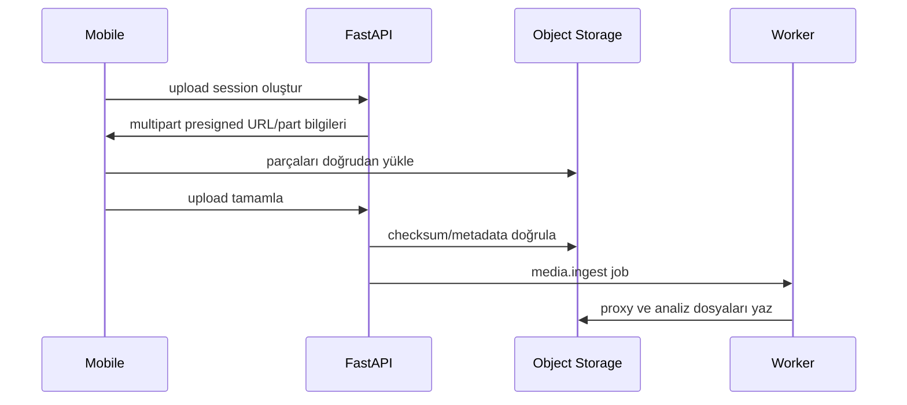
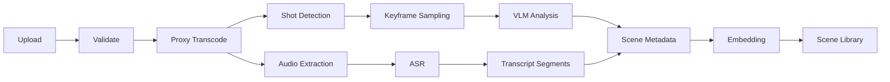

**Medya yükleme altyapısı ve video analiz hattı** · PRD bölümleri: §15, §16

> Bu dosyadaki bölümler `docs/product/product-requirements.md`'den **birebir** taşındı. Metin değiştirilmez, bölüm numaraları korunur.
> İndeks: [product-requirements.md](../product-requirements.md) · Router: [docs/index.md](../../index.md)

---

# 15. Medya yükleme altyapısı

## 15.1 Yükleme akışı

Mobil uygulama medya dosyasını FastAPI veya n8n üzerinden taşımaz.



## 15.2 Gereksinimler

- Multipart/resumable upload
- SHA-256 checksum
- MIME doğrulama
- ffprobe doğrulaması
- Dosya boyutu limiti plan bazlı
- Aynı dosya hash’i ile deduplication
- Ağ kesintisinde devam
- Mobil arka plan yükleme
- Yükleme ilerleme yüzdesi
- İptal
- Virüs/malware taraması
- Dosya adından bağımsız UUID
- Orijinal dosya immutable

## 15.3 Object storage düzeni

```text
tenant/{business_id}/media/{asset_id}/original/source.mp4
tenant/{business_id}/media/{asset_id}/proxy/720p.mp4
tenant/{business_id}/media/{asset_id}/audio/source.wav
tenant/{business_id}/media/{asset_id}/thumbs/0001.jpg
tenant/{business_id}/media/{asset_id}/scenes/{scene_id}.mp4
tenant/{business_id}/content/{project_id}/renders/{version_id}.mp4
tenant/{business_id}/content/{project_id}/captions/{version_id}.vtt
```

## 15.4 Medya durumları

```text
uploading
uploaded
validating
processing
ready
rejected
quarantined
deleted
purging
```

## 15.5 Proxy üretimi

Analiz ve ön izleme için:

- 720p H.264 proxy
- AAC ses
- Normalize edilmiş frame rate
- Fast-start MP4
- Thumbnail strip
- Audio waveform
- Orijinal korunur

AI sağlayıcıya mümkünse orijinal yerine proxy veya seçilmiş sahneler gönderilir.

---

# 16. Video analiz hattı



## 16.1 Yerel analiz

Ücretli API çağrısından önce:

- Süre
- Çözünürlük
- Codec
- FPS
- En-boy oranı
- Parlaklık
- Bulanıklık
- Siyah kare
- Aşırı titreme
- Ses seviyesi
- Sessizlik
- Sahne değişimleri
- Yüz alanı
- Motion score

## 16.2 ASR

Çıktı:

```json
{
  "language": "tr",
  "segments": [
    {
      "start_ms": 2100,
      "end_ms": 5200,
      "text": "Yeni ürünümüz bugün satışta.",
      "confidence": 0.94,
      "speaker": "S1"
    }
  ]
}
```

Gereksinimler:

- Türkçe
- Zaman damgası
- VTT/SRT üretimi
- Gürültülü ortam desteği
- Marka terim sözlüğü
- Düşük confidence segmentlerinde ikinci sağlayıcı
- Kullanıcı düzeltmesiyle sözlük öğrenme

## 16.3 VLM sahne analizi

Her sahne için yapılandırılmış JSON:

```json
{
  "summary": "Barista latte üzerine desen yapıyor",
  "scene_type": "preparation",
  "objects": ["kahve", "fincan", "süt"],
  "people_count": 1,
  "products": ["Soğuk Latte"],
  "brand_logo_visible": false,
  "text_detected": [],
  "quality": {
    "sharpness": 0.88,
    "lighting": 0.82,
    "stability": 0.76,
    "composition": 0.91
  },
  "marketing": {
    "hook_score": 0.84,
    "product_visibility": 0.94,
    "emotion_score": 0.67,
    "cta_suitability": 0.20
  },
  "suitable_scenarios": ["product_reels", "voiceover_ad"],
  "unsafe_flags": []
}
```

## 16.4 Sahne kütüphanesi

Sahneler şu özelliklerle aranabilir:

- Ürün
- Şube
- İnsan var/yok
- Yüz yakın plan
- Hazırlık
- Son ürün
- Mekân
- Dış cephe
- Before/after
- Enerji
- Kalite
- Dikey kadraja uygunluk
- Daha önce kullanım sayısı
- Son kullanım tarihi
- Performans geçmişi

## 16.5 Embedding ve retrieval

- Sahne açıklaması için text embedding
- Keyframe için multimodal embedding, sağlayıcı destekliyorsa
- pgvector
- Marka ve senaryo sorgusuna göre top-k sahne
- Sonuçlar VLM rerank ile doğrulanabilir
- Aynı videodan aşırı sahne seçimini engelleyen diversity penalty
