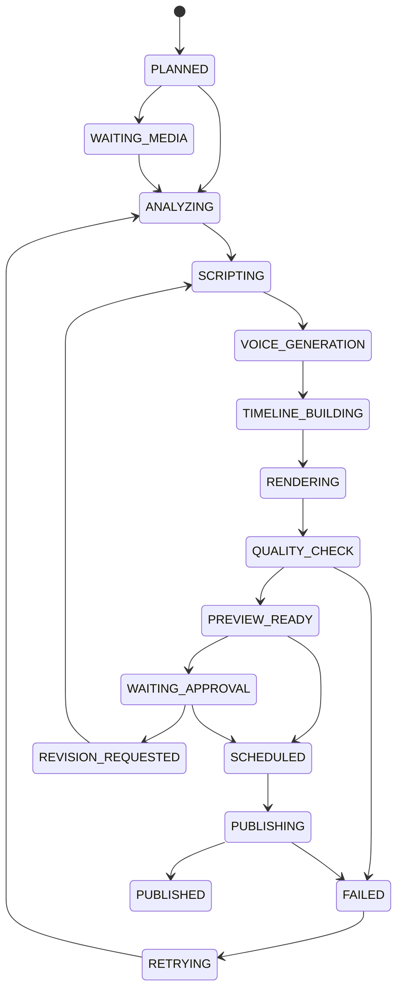

**Senaryo/timeline üretimi, render, yaşam döngüsü ve onay** · PRD bölümleri: §18, §19, §20, §21

> Bu dosyadaki bölümler `docs/product/product-requirements.md`'den **birebir** taşındı. Metin değiştirilmez, bölüm numaraları korunur.
> İndeks: [product-requirements.md](../product-requirements.md) · Router: [docs/index.md](../../index.md)

---

# 18. Senaryo, seslendirme ve timeline üretimi

## 18.1 Senaryo contract

```json
{
  "hook": {
    "text": "Bugünün en taze molası hazır.",
    "duration_ms": 2200
  },
  "segments": [
    {
      "purpose": "hook",
      "voice_text": "Bugünün en taze molası hazır.",
      "required_scene_tags": ["product_closeup"],
      "target_duration_ms": 2200
    },
    {
      "purpose": "process",
      "voice_text": "Her sipariş özenle hazırlanıyor.",
      "required_scene_tags": ["preparation"],
      "target_duration_ms": 4500
    }
  ],
  "cta": {
    "text": "Bugün bizi ziyaret et.",
    "source": "approved_cta"
  }
}
```

## 18.2 Timeline schema

```json
{
  "version": "1.0",
  "canvas": {
    "width": 1080,
    "height": 1920,
    "fps": 30,
    "duration_ms": 20000
  },
  "video_tracks": [
    {
      "track": 1,
      "clips": [
        {
          "asset_id": "uuid",
          "source_start_ms": 4200,
          "source_end_ms": 7100,
          "timeline_start_ms": 0,
          "crop_mode": "smart_cover",
          "transition_out": "cut"
        }
      ]
    }
  ],
  "audio_tracks": [
    {
      "type": "voiceover",
      "asset_id": "uuid",
      "gain_db": 0
    },
    {
      "type": "music",
      "asset_id": "uuid",
      "gain_db": -18,
      "duck_under_voice": true
    }
  ],
  "overlays": [
    {
      "type": "text",
      "text_source": "verified_campaign.title",
      "start_ms": 0,
      "end_ms": 3000,
      "safe_area": true
    }
  ],
  "captions": {
    "enabled": true,
    "source": "voiceover",
    "style_id": "brand-caption-v1"
  }
}
```

## 18.3 Timeline doğrulama

Render öncesi:

- Süre taşması
- Asset erişimi
- Kesit zaman aralığı
- Aspect ratio
- Minimum çözünürlük
- Seslendirme süresi
- Metin safe-area
- Kampanya tarihi
- Logo kullanımı
- Yasak kelime
- Müzik lisansı
- Duplicate clip
- Black frame
- Audio clipping

---

# 19. Render altyapısı

## 19.1 FFmpeg worker

Görevler:

- Kesme
- Birleştirme
- Smart crop
- Blur background
- Zoom/pan
- Color normalize
- Logo overlay
- Text overlay
- Subtitle burn-in
- Voiceover
- Music ducking
- Original sound mix
- Loudness normalization
- Thumbnail
- Platform varyantları

## 19.2 Render profilleri

```text
instagram_reels_1080x1920
instagram_story_1080x1920
instagram_feed_1080x1350
instagram_square_1080x1080
x_video_1280x720
x_vertical_1080x1920
preview_540x960
```

Gerçek platform limitleri adapter capability endpoint’inden kontrol edilmelidir.

## 19.3 Worker izolasyonu

- Her render ayrı process/container
- CPU/GPU limiti
- Disk kotası
- Temporary directory cleanup
- Timeout
- Retry yalnızca güvenli adımlarda
- Partial output silme
- Job heartbeat
- Dead-letter queue
- Kaynak URL’ler kısa süreli signed URL

## 19.4 Kalite kontrol

Otomatik QC:

- Video açılıyor mu
- Süre doğru mu
- Ses var mı
- Loudness
- Siyah frame
- Boş/sabit görüntü
- Yazılar kadraj dışında mı
- Logo görünür mü
- Altyazı senkronu
- Fiyat ve tarih kaynağa uyuyor mu
- Hassas/uygunsuz içerik
- Yüz bozulması
- Üretken sahnede ürün şekli değişmiş mi

QC başarısızsa:

- Yeniden render
- Alternatif sahne
- Alternatif sağlayıcı
- İnsan incelemesi
- Kullanıcıdan yeni medya talebi

---

# 20. İçerik proje yaşam döngüsü



Her durum geçişi transactional olarak kaydedilmelidir.

---

# 21. Onay sistemi

## 21.1 Onay politikaları

- `always`
- `campaign_only`
- `price_or_discount_only`
- `ads_only`
- `first_n_contents`
- `low_confidence_only`
- `never_within_guardrails`

## 21.2 Reddetme nedenleri

- Yanlış ürün
- Yanlış fiyat
- Yanlış kesit
- Marka diline uygun değil
- Ses uygun değil
- Müzik uygun değil
- Çok uzun/kısa
- Kalite düşük
- Yeni konsept istiyorum
- Diğer

Reddetme nedeni model öğrenme verisi olarak kullanılabilir ancak kullanıcıya özel kalmalıdır.

## 21.3 Revizyon

Küçük revizyon:

- CTA
- Başlık
- Bir kesit
- Ses
- Müzik
- Altyazı stili

Büyük revizyon:

- İçerik türü değişikliği
- Ürün değişikliği
- Tüm konseptin değişmesi
- Sürenin sınıf değiştirmesi

Küçük/büyük ayrımı kural motoru ve gerektiğinde operasyon tarafından belirlenir.
