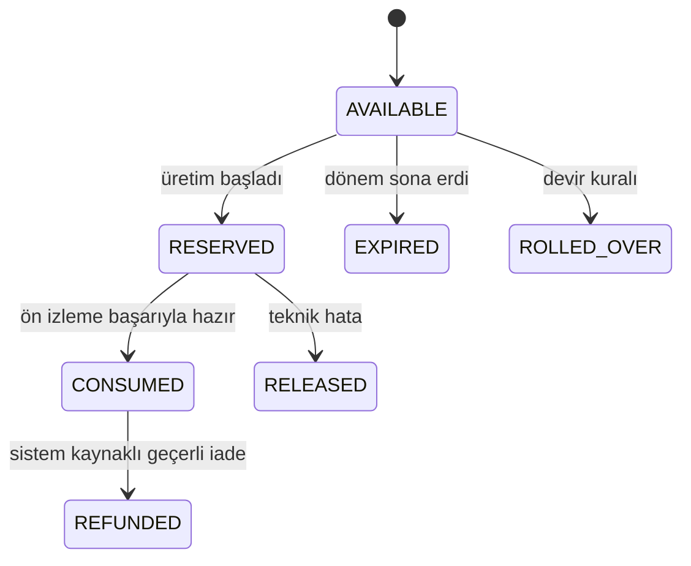

**Esnek abonelik, hak motoru ve store faturalandırma** · PRD bölümleri: §12, §32

> Bu dosyadaki bölümler `docs/product/product-requirements.md`'den **birebir** taşındı. Metin değiştirilmez, bölüm numaraları korunur.
> İndeks: [product-requirements.md](../product-requirements.md) · Router: [docs/index.md](../../index.md)

---

# 12. Esnek abonelik modeli

## 12.1 Kullanıcı deneyimi

Kullanıcı hazır paket veya “Kendi Paketini Oluştur” seçeneğini seçer.

Örnek seçim:

```text
Instagram Reels: Her gün 1
Instagram hikâye: Her gün 2
Instagram carousel: Haftada 1
Premium video: Haftada 1
X gönderisi: Hafta içi her gün 1
X thread: Haftada 1
Reklam kreatifi: Ayda 4
Meta + Google reklam yönetimi: Aktif
Otomasyon: Yarı otomatik
```

## 12.2 Abonelik kalemi şeması

```json
{
  "content_type": "instagram_reels",
  "platform": "instagram",
  "frequency": {
    "unit": "day",
    "count": 1,
    "active_days": ["MO", "TU", "WE", "TH", "FR", "SA", "SU"]
  },
  "quality_tier": "professional",
  "automation_mode": "auto_publish",
  "approval_policy": "campaign_only",
  "revision_limit": 1,
  "rollover_policy": "none",
  "preferred_publish_windows": [
    {"start": "18:00", "end": "20:00"}
  ],
  "content_constraints": {
    "max_duration_seconds": 30,
    "voiceover": true,
    "captions": true
  }
}
```

## 12.3 Kalite seviyeleri

### Standard

- Yerel sahne analizi + hızlı VLM
- Standart senaryo
- Standart TTS
- Basit geçişler
- Bir kalite kontrol
- Bir revizyon

### Professional

- Daha güçlü VLM doğrulaması
- Gelişmiş sahne sıralama
- Marka uyumu kontrolü
- Premium TTS
- Çok katmanlı ses miksajı
- İki kalite kontrol
- İki revizyon

### Premium Ad

- Çoklu senaryo varyasyonu
- A/B kreatifleri
- Gerekirse generative B-roll
- Gelişmiş renk/ses düzenleme
- Premium model routing
- Reklam politika ön kontrolü
- Üç revizyon

## 12.4 İçerik puanı/credit sistemi

Mobil mağazalarda her kullanıcı için sınırsız sayıda dinamik abonelik ürünü oluşturmak yönetilemez. Bu nedenle kullanıcı özel kombinasyon oluşturur ancak faturalandırma sınırlı sayıdaki kredi seviyesine eşlenir.

Örnek puanlar:

| İçerik | Puan |
|---|---:|
| X gönderisi | 1 |
| Hikâye | 1 |
| Statik post | 2 |
| Carousel | 3 |
| Standard Reels | 5 |
| Professional Reels | 8 |
| Premium video | 20 |
| Reklam kreatifi varyasyonu | 5 |
| Generative video sahnesi | 10+ |

Aylık ihtiyaç hesaplanır:

```text
Aylık ihtiyaç = içerik sıklığı × içerik puanı × kalite çarpanı
```

Kullanıcı en yakın kredi aboneliğine eşlenir:

```text
Flex 100
Flex 250
Flex 500
Flex 1000
Flex 2000
```

Kalan kredi “esnek hak” olarak kullanılabilir.

Bu yaklaşım iki katmanı ayırır:

- **Store ürünü:** Fiyatlandırma ve tahsilat
- **Sunucu abonelik tanımı:** Kullanıcının gerçek içerik takvimi
- **Entitlement ledger:** Hangi hakların kullanılabildiği

## 12.5 Mobil mağaza ve B2B ayrımı

Dijital içerik/hizmet abonelikleri için mobil mağaza ödeme politikaları dikkate alınmalıdır.

Önerilen strateji:

### Bireysel/KOBİ mobil kullanıcı

- iOS: StoreKit auto-renewable subscription
- Android: Google Play Billing subscription
- Ek tek seferlik içerikler: consumable kredi paketi
- Satın alma sunucuda doğrulanır
- Store bildirimleriyle entitlement güncellenir

### Kurumsal/özel sözleşme

- Web veya satış sözleşmesi üzerinden tanımlanır
- Mobil uygulama yalnızca aktif entitlement’ı gösterir
- Uygulama içinde mağaza kurallarını ihlal edecek dış ödeme yönlendirmesi yapılmaz
- Hukuk ve mağaza incelemesi öncesinde son satın alma akışı doğrulanmalıdır

## 12.6 Hak dönemi

- Günlük
- Haftalık
- Aylık
- Fatura dönemi
- Kampanya dönemi
- Tek seferlik

## 12.7 Hak yaşam döngüsü



## 12.8 Hak tüketme kuralları

Hak, kullanıcı butona bastığında kesin tüketilmez.

1. Hak uygunluğu kontrol edilir.
2. `usage_reservation` açılır.
3. İşlem tamamlanır.
4. Ön izleme ve kalite kontrol başarıysa tüketilir.
5. Teknik hata varsa rezervasyon bırakılır.
6. Kullanıcı tamamen farklı konsept isterse yeni hak gerekebilir.
7. Küçük revizyonlar revizyon kotasından düşer.

## 12.9 Devir politikası

- Günlük içerik hakkı: varsayılan devretmez
- Haftalık premium video: en fazla bir dönem devredebilir
- Aylık esnek kredi: planın belirlediği yüzde kadar devredebilir
- Kullanıcı kaynaklı medya eksikliği: hak geçici ertelenebilir
- Sistem arızası: hak süresi uzatılmalıdır

## 12.10 Abonelik durumları

```text
trialing
active
past_due
grace_period
paused
canceled
expired
refunded
billing_retry
store_mismatch
```

Sunucu tarafı entitlement tek başına mobil istemciye güvenerek açılmaz.

---

# 32. Faturalandırma ve store doğrulama

## 32.1 Kaynaklar

- iOS transaction
- Android purchase token
- Kurumsal invoice
- Promosyon/admin grant

## 32.2 Server doğrulama

- Mobil istemci satın alma sonucunu backend’e yollar
- Backend store sunucusuyla doğrular
- Transaction unique kontrolü
- Subscription state güncellenir
- Entitlement açılır
- Store server notification geldiğinde state yeniden hesaplanır
- Refund/revoke hakları geri çeker
- Grace period kuralları uygulanır

## 32.3 Store fiyatı

Fiyat mobil uygulamada backend tarafından uydurulmamalıdır. Store SDK’nın lokalize ettiği fiyat gösterilir.

## 32.4 Kredi defteri

```text
credit_ledger
- entry_type: grant / reserve / consume / refund / expire / adjust
- amount
- balance_after
- source_type
- source_id
- idempotency_key
```

Negatif bakiye oluşmamalıdır.
