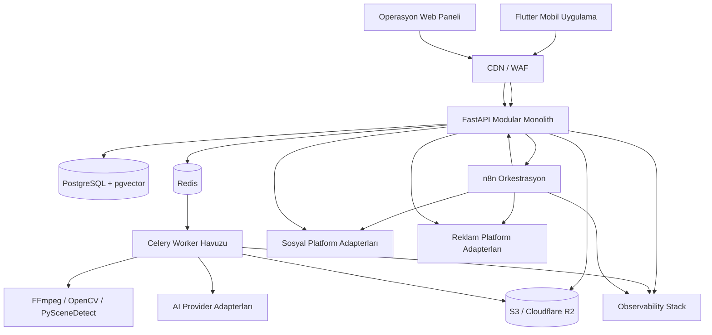

**Sistem mimarisi, teknoloji yığını, depo yapısı, env ve feature flag** · PRD bölümleri: §6, §7, §8, §42, §43

> Bu dosyadaki bölümler `docs/product/product-requirements.md`'den **birebir** taşındı. Metin değiştirilmez, bölüm numaraları korunur.
> İndeks: [product-requirements.md](../product-requirements.md) · Router: [docs/index.md](../../index.md)

---

# 6. Yüksek seviyeli sistem mimarisi



## 6.1 Mimari yaklaşım

İlk sürümde mikroservis kullanılmamalıdır. **Modüler monolit + bağımsız worker süreçleri** kullanılmalıdır.

Neden:

- Domain karmaşık, ekip başlangıçta küçük olacaktır.
- Transaction sınırlarını korumak daha kolaydır.
- Kod ve veri modeli daha hızlı evrilir.
- Ağ üzerinden gereksiz servis bağımlılığı oluşmaz.
- Ağır medya işleri API sürecinden ayrılabilir.

Aşağıdakiler ayrı çalıştırılabilir süreçlerdir:

- `api`
- `scheduler`
- `worker-media-analysis`
- `worker-render`
- `worker-ai`
- `worker-publishing`
- `worker-ads`
- `n8n`
- `admin-web`

İleride yük artınca domain modülleri servisleştirilebilir.

---

# 7. Önerilen teknoloji yığını

## 7.1 Mobil

- Flutter
- Riverpod
- go_router
- Dio
- freezed + json_serializable
- flutter_secure_storage
- Drift veya eşdeğer yerel SQL katmanı
- video_player
- image_picker/file_picker
- Firebase Cloud Messaging
- Firebase Authentication
- Sentry Flutter
- resumable multipart upload client

## 7.2 Backend

- Python
- FastAPI
- Pydantic v2
- SQLAlchemy 2
- Alembic
- PostgreSQL
- pgvector
- Redis
- Celery
- httpx
- tenacity
- structlog
- OpenTelemetry
- FFmpeg
- ffprobe
- OpenCV
- PySceneDetect

## 7.3 Web admin

- Next.js
- TypeScript
- TanStack Query
- React Hook Form
- Zod
- Yetki kontrollü internal admin UI

## 7.4 Altyapı

- Docker
- Docker Compose: yerel geliştirme
- Terraform: üretim altyapısı
- Kubernetes/ECS/benzeri: ölçek aşaması
- S3 veya Cloudflare R2
- Cloudflare CDN/WAF
- Vault veya cloud secret manager
- GitHub Actions
- Sentry
- Prometheus + Grafana
- Loki veya yönetilen log servisi

## 7.5 Orkestrasyon

- n8n: zamanlama, entegrasyon, bildirim ve iş akışı koordinasyonu
- Celery + Redis: ağır ve asenkron uygulama işleri
- PostgreSQL: iş durumunun ve domain gerçekliğinin tek kaynağı

---

# 8. Kaynak kod deposu

```text
socialpilot-ai/
├── apps/
│   ├── mobile/
│   └── admin-web/
├── services/
│   ├── api/
│   │   ├── app/
│   │   │   ├── core/
│   │   │   ├── modules/
│   │   │   │   ├── identity/
│   │   │   │   ├── businesses/
│   │   │   │   ├── brands/
│   │   │   │   ├── media/
│   │   │   │   ├── content/
│   │   │   │   ├── subscriptions/
│   │   │   │   ├── billing/
│   │   │   │   ├── connectors/
│   │   │   │   ├── publishing/
│   │   │   │   ├── advertising/
│   │   │   │   ├── analytics/
│   │   │   │   ├── notifications/
│   │   │   │   └── admin/
│   │   │   ├── adapters/
│   │   │   │   ├── ai/
│   │   │   │   ├── social/
│   │   │   │   ├── ads/
│   │   │   │   ├── billing/
│   │   │   │   ├── storage/
│   │   │   │   └── notifications/
│   │   │   └── main.py
│   │   └── tests/
│   ├── workers/
│   │   ├── media_analysis/
│   │   ├── ai_generation/
│   │   ├── rendering/
│   │   ├── publishing/
│   │   └── advertising/
│   └── scheduler/
├── packages/
│   ├── contracts/
│   ├── domain-events/
│   ├── prompt-schemas/
│   ├── timeline-schema/
│   └── test-fixtures/
├── workflows/
│   └── n8n/
├── infra/
│   ├── docker/
│   ├── terraform/
│   ├── kubernetes/
│   └── monitoring/
├── docs/
│   ├── adr/
│   ├── api/
│   ├── runbooks/
│   └── security/
├── scripts/
├── .github/workflows/
└── README.md
```

---

# 42. Ortam değişkenleri

Örnek; gerçek secret repo içinde tutulmaz.

```env
APP_ENV=
DATABASE_URL=
REDIS_URL=
OBJECT_STORAGE_ENDPOINT=
OBJECT_STORAGE_BUCKET=
OBJECT_STORAGE_ACCESS_KEY=
OBJECT_STORAGE_SECRET_KEY=
OBJECT_STORAGE_SIGNING_TTL_SECONDS=

FIREBASE_PROJECT_ID=
FIREBASE_CREDENTIALS_SECRET_REF=

N8N_BASE_URL=
N8N_WEBHOOK_SECRET=
N8N_ENCRYPTION_KEY_SECRET_REF=

META_APP_ID=
META_APP_SECRET_SECRET_REF=
META_WEBHOOK_VERIFY_TOKEN_SECRET_REF=

GOOGLE_OAUTH_CLIENT_ID=
GOOGLE_OAUTH_CLIENT_SECRET_SECRET_REF=
GOOGLE_ADS_DEVELOPER_TOKEN_SECRET_REF=
GOOGLE_ADS_MANAGER_CUSTOMER_ID=

X_CLIENT_ID=
X_CLIENT_SECRET_SECRET_REF=
X_ADS_ACCESS_CONFIG_SECRET_REF=

AI_PROVIDER_QWEN_KEY_SECRET_REF=
AI_PROVIDER_DEEPSEEK_KEY_SECRET_REF=
AI_PROVIDER_MINIMAX_KEY_SECRET_REF=
AI_PROVIDER_VOLCENGINE_KEY_SECRET_REF=
AI_PROVIDER_KLING_KEY_SECRET_REF=
AI_PROVIDER_OPENAI_KEY_SECRET_REF=

SENTRY_DSN=
OTEL_EXPORTER_OTLP_ENDPOINT=
```

---

# 43. Feature flag’ler

```text
instagram_publishing
instagram_stories
x_publishing
meta_ads
google_ads
x_ads
premium_video
generative_broll
voice_cloning
auto_publish
semi_auto_ads
full_auto_ads
cross_platform_budget
```

Feature flag tenant, platform ve environment bazlı olmalıdır.
